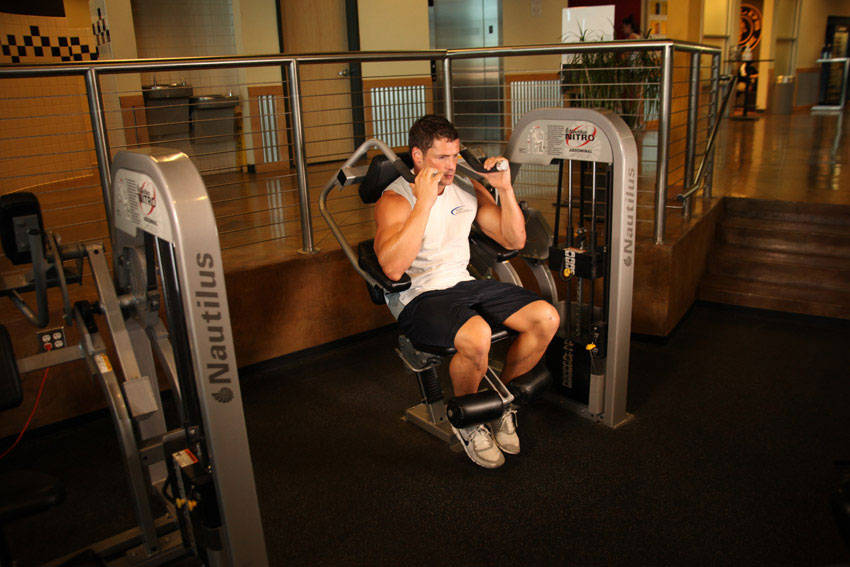

# 腹肌卷腹器械

**Ab Crunch Machine**

> 部位：核心　|　器械：固定器械　|　难度：⭐⭐ 进阶　|　类型：力量训练 · 孤立动作 · 拉

## 目标肌群

- **主要**：腹肌
- **协同**：—

## 动作示意图

| 起始位 | 结束位 |
|:---:|:---:|
|  |  |

## 动作要点

1. 屈膝仰卧，下背贴紧地面或垫子，双手放在耳侧或交叉抱胸。
2. 呼气，用腹肌把肋骨往骨盆方向「卷」，肩胛离地即可。
3. 注意是脊柱一节节卷起，不是用脖子把头拽起来。
4. 顶峰停顿一秒，主动挤压腹部。
5. 吸气缓慢还原，肩胛落地但腹部保持张力，不要完全松掉。

## 常见错误

- ❌ 双手抱头往前拽 → 颈椎受力，脖子先酸
- ❌ 起身幅度过大变成仰卧起坐 → 髋屈肌主导
- ❌ 靠惯性快速上下 → 腹肌几乎不受力
- ✅ 卷腹不是抬头、幅度小而慢、顶峰挤压

## 训练建议

3–4 组 × 10–15 次，组间休息 45–75 秒；小重量找目标肌群的收缩感。

<b>英文原始步骤 / Original Instructions</b>（点击展开）

1. Select a light resistance and sit down on the ab machine placing your feet under the pads provided and grabbing the top handles. Your arms should be bent at a 90 degree angle as you rest the triceps on the pads provided. This will be your starting position.
2. At the same time, begin to lift the legs up as you crunch your upper torso. Breathe out as you perform this movement. Tip: Be sure to use a slow and controlled motion. Concentrate on using your abs to move the weight while relaxing your legs and feet.
3. After a second pause, slowly return to the starting position as you breathe in.
4. Repeat the movement for the prescribed amount of repetitions.

---

[← 返回核心部位索引](README.md)　|　[返回首页](../../README.md)

数据与图片来源：[yuhonas/free-exercise-db](https://github.com/yuhonas/free-exercise-db)（The Unlicense，公有领域）　·　中文名称、动作要点与内容组织：Yue（gengyueworks）
