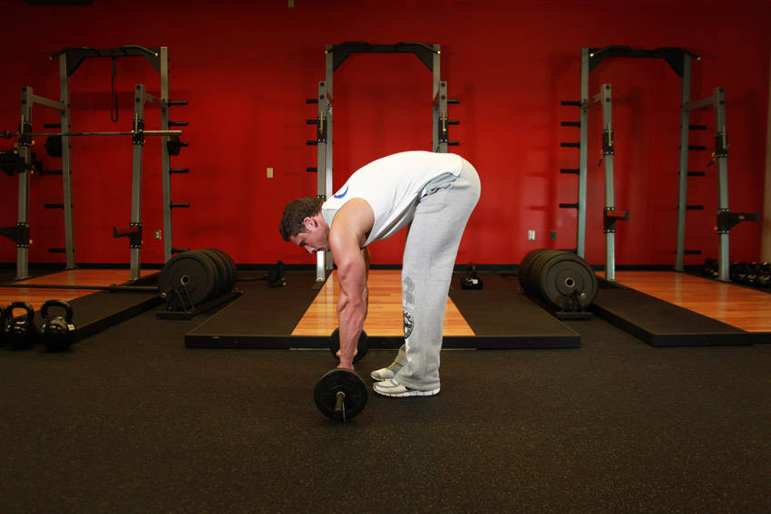

# 杠铃腹肌滚轮

**Barbell Ab Rollout**

> 部位：核心　|　器械：杠铃　|　难度：⭐⭐ 进阶　|　类型：力量训练 · 复合动作 · 拉

## 目标肌群

- **主要**：腹肌
- **协同**：下背（竖脊肌）、三角肌

## 动作示意图

| 起始位 | 结束位 |
|:---:|:---:|
|  |  |

## 动作要点

1. 前臂或手掌撑地，肘关节在肩正下方，双脚与髋同宽。
2. 收紧核心和臀部，让肩、髋、踝连成一条直线。
3. 骨盆微微后倾（想象把尾骨往下夹），消除腰部塌陷。
4. 保持均匀呼吸，不要憋气，眼睛看向双手之间的地面。
5. 以能保持标准姿势的时间为准，姿势一变形就结束这一组。

## 常见错误

- ❌ 塌腰 → 腰椎承受压力，核心反而没练到
- ❌ 撅臀 → 降低难度、核心卸力
- ❌ 憋气硬撑 → 血压升高且撑不久
- ✅ 一条直线、收紧臀部、正常呼吸

## 训练建议

3–5 组 × 6–12 次，组间休息 90–150 秒；先把动作做标准再加重量。

<b>英文原始步骤 / Original Instructions</b>（点击展开）

1. For this exercise you will need to get into a pushup position, but instead of having your hands of the floor, you will be grabbing on to an Olympic barbell (loaded with 5-10 lbs on each side) instead. This will be your starting position.
2. While keeping a slight arch on your back, lift your hips and roll the barbell towards your feet as you exhale. Tip: As you perform the movement, your glutes should be coming up, you should be keeping the abs tight and should maintain your back posture at all times. Also your arms should be staying perpendicular to the floor throughout the movement. If you don't, you will work out your shoulders and back more than the abs.
3. After a second contraction at the top, start to roll the barbell back forward to the starting position slowly as you inhale.
4. Repeat for the recommended amount of repetitions.

---

[← 返回核心部位索引](README.md)　|　[返回首页](../../README.md)

数据与图片来源：[yuhonas/free-exercise-db](https://github.com/yuhonas/free-exercise-db)（The Unlicense，公有领域）　·　中文名称、动作要点与内容组织：Yue（gengyueworks）
