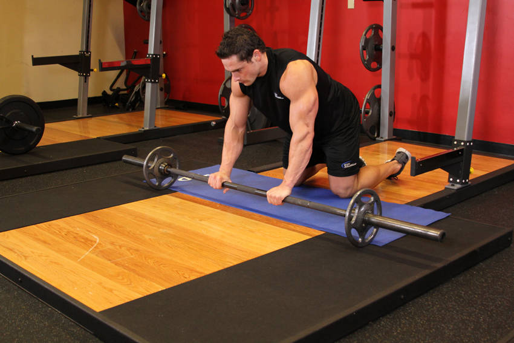

# 杠铃腹肌滚轮（膝）

**Barbell Ab Rollout - On Knees**

> 部位：核心　|　器械：杠铃　|　难度：⭐⭐⭐ 高手　|　类型：力量训练 · 复合动作 · 拉

## 目标肌群

- **主要**：腹肌
- **协同**：下背（竖脊肌）、三角肌

## 动作示意图

| 起始位 | 结束位 |
|:---:|:---:|
|  |  |

## 动作要点

1. 前臂或手掌撑地，肘关节在肩正下方，双脚与髋同宽。
2. 收紧核心和臀部，让肩、髋、踝连成一条直线。
3. 骨盆微微后倾（想象把尾骨往下夹），消除腰部塌陷。
4. 保持均匀呼吸，不要憋气，眼睛看向双手之间的地面。
5. 以能保持标准姿势的时间为准，姿势一变形就结束这一组。

## 常见错误

- ❌ 塌腰 → 腰椎承受压力，核心反而没练到
- ❌ 撅臀 → 降低难度、核心卸力
- ❌ 憋气硬撑 → 血压升高且撑不久
- ✅ 一条直线、收紧臀部、正常呼吸

## 训练建议

3–5 组 × 6–12 次，组间休息 90–150 秒；先把动作做标准再加重量。

<b>英文原始步骤 / Original Instructions</b>（点击展开）

1. Hold an Olympic barbell loaded with 5-10lbs on each side and kneel on the floor.
2. Now place the barbell on the floor in front of you so that you are on all your hands and knees (as in a kneeling push up position). This will be your starting position.
3. Slowly roll the barbell straight forward, stretching your body into a straight position. Tip: Go down as far as you can without touching the floor with your body. Breathe in during this portion of the movement.
4. After a second pause at the stretched position, start pulling yourself back to the starting position as you breathe out. Tip: Go slowly and keep your abs tight at all times.

---

[← 返回核心部位索引](README.md)　|　[返回首页](../../README.md)

数据与图片来源：[yuhonas/free-exercise-db](https://github.com/yuhonas/free-exercise-db)（The Unlicense，公有领域）　·　中文名称、动作要点与内容组织：Yue（gengyueworks）
