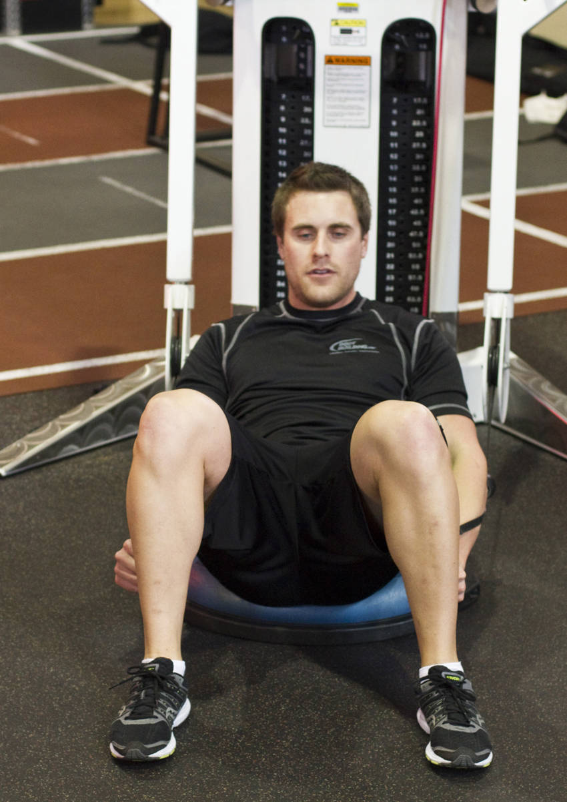

# 波速球绳索卷腹（体侧屈）

**Bosu Ball Cable Crunch With Side Bends**

> 部位：核心　|　器械：绳索　|　难度：⭐ 新手　|　类型：力量训练 · 孤立动作 · 拉

## 目标肌群

- **主要**：腹肌
- **协同**：—

## 动作示意图

| 起始位 | 结束位 |
|:---:|:---:|
|  |  |

## 动作要点

1. 屈膝仰卧，下背贴紧地面或垫子，双手放在耳侧或交叉抱胸。
2. 呼气，用腹肌把肋骨往骨盆方向「卷」，肩胛离地即可。
3. 注意是脊柱一节节卷起，不是用脖子把头拽起来。
4. 顶峰停顿一秒，主动挤压腹部。
5. 吸气缓慢还原，肩胛落地但腹部保持张力，不要完全松掉。

## 常见错误

- ❌ 双手抱头往前拽 → 颈椎受力，脖子先酸
- ❌ 起身幅度过大变成仰卧起坐 → 髋屈肌主导
- ❌ 靠惯性快速上下 → 腹肌几乎不受力
- ✅ 卷腹不是抬头、幅度小而慢、顶峰挤压

## 训练建议

3–4 组 × 10–15 次，组间休息 45–75 秒；小重量找目标肌群的收缩感。

<b>英文原始步骤 / Original Instructions</b>（点击展开）

1. Connect a standard handle to each arm of a cable machine, and position them in the most downward position.
2. Grab a Bosu Ball and position it in front and center of the cable machine.
3. Lie down on the Bosu Ball with the small of your back arched around the ball. Your rear end should be close to the floor without touching it.
4. With both hands, reach back and grab the handle of each cable.
5. With your feet positioned in a wide stance, extend your arms straight out in front of you and in between your knees. Your hands should be at knee level.
6. Keep your arms straight and in-line with the upward angle of the cable. Elevate your torso in a crunching motion without dropping or bending your arms.
7. Maintain the rigid position with your arms. Slowly descend back to the starting position with your back arched around the Bosu Ball and your abdominals elongated.
8. Repeat the same series of movements to failure.
9. Once you reach failure, keep your abs tight and raise your torso into plank position so your back is elevated off the Bosu Ball.
10. Lower your arms down to your side; keep them straight. Start doing alternating side bends; reach for your heels! This finishing movement will focus on your obliques.

---

[← 返回核心部位索引](README.md)　|　[返回首页](../../README.md)

数据与图片来源：[yuhonas/free-exercise-db](https://github.com/yuhonas/free-exercise-db)（The Unlicense，公有领域）　·　中文名称、动作要点与内容组织：Yue（gengyueworks）
