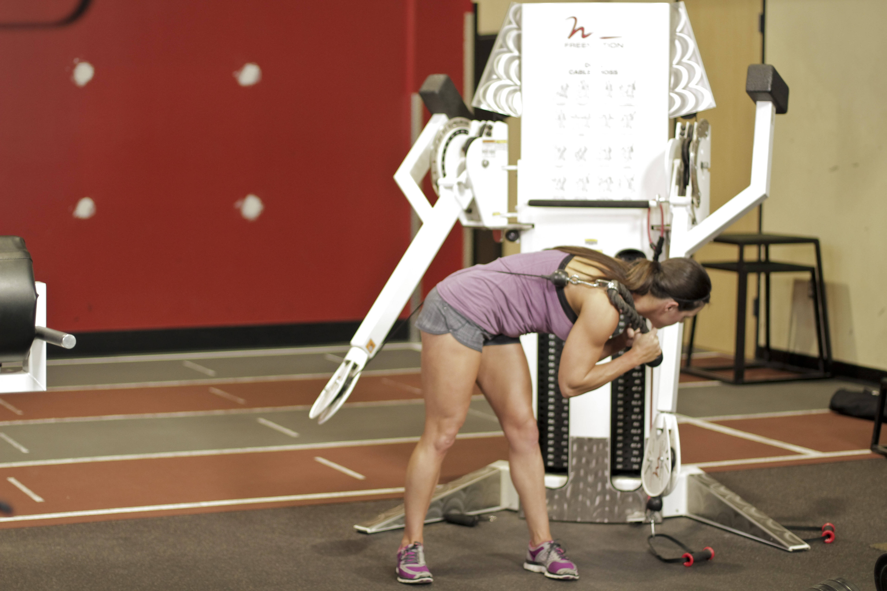

# 绳索柔道翻

**Cable Judo Flip**

> 部位：核心　|　器械：绳索　|　难度：⭐ 新手　|　类型：力量训练 · 复合动作 · 拉

## 目标肌群

- **主要**：腹肌
- **协同**：—

## 动作示意图

| 起始位 | 结束位 |
|:---:|:---:|
|  |  |

## 动作要点

1. 调整好起始姿势，用绳索建立稳定的支撑与握持。
2. 核心收紧、脊柱保持中立，这是所有动作的共同前提。
3. 呼气发力，用腹肌主导完成动作，避免其他部位代偿借力。
4. 在肌肉完全收缩的位置停顿一秒，主动感受腹肌发力。
5. 吸气用 2–3 秒缓慢还原到起始位，全程保持张力不松掉。

## 常见错误

- ❌ 靠身体摆动借力 → 通常意味着重量选大了
- ❌ 只做半程 → 肌肉没有被充分拉长和收缩
- ❌ 屏气硬撑 → 血压骤升，发力时呼气才对
- ✅ 控制节奏、完整幅度、目标肌群主导

## 训练建议

3–5 组 × 6–12 次，组间休息 90–150 秒；先把动作做标准再加重量。

<b>英文原始步骤 / Original Instructions</b>（点击展开）

1. Connect a rope attachment to a tower, and move the cable to the lowest pulley position. Stand with your side to the cable with a wide stance, and grab the rope with both hands.
2. Twist your body away from the pulley as you bring the rope over your shoulder like you're performing a judo flip.
3. Shift your weight between your feet as you twist and crunch forward, pulling the cable downward.
4. Return to the starting position and repeat until failure.
5. Then, reposition and repeat the same series of movements on the opposite side.

---

[← 返回核心部位索引](README.md)　|　[返回首页](../../README.md)

数据与图片来源：[yuhonas/free-exercise-db](https://github.com/yuhonas/free-exercise-db)（The Unlicense，公有领域）　·　中文名称、动作要点与内容组织：Yue（gengyueworks）
