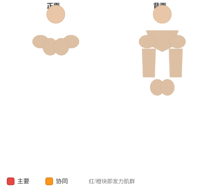
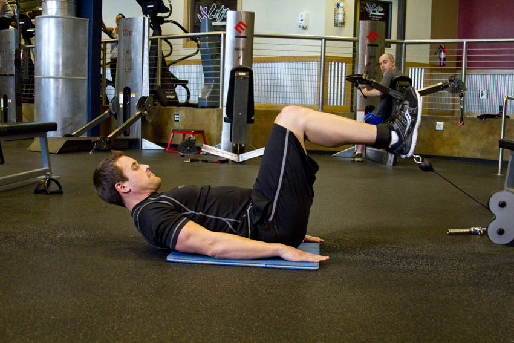

# 绳索反向卷腹

**Cable Reverse Crunch**

> 部位：核心　|　器械：绳索　|　难度：⭐ 新手　|　类型：力量训练 · 孤立动作 · 拉

## 目标肌群

- **主要**：腹肌
- **协同**：—

## 肌肉激活示意

🔴 主要肌群　🟠 协同肌群（红/橙块即发力部位，鼠标悬停看名称）

## 动作示意图

| 起始位 | 结束位 |
|:---:|:---:|
|  |  |

## 动作要点

1. 屈膝仰卧，下背贴紧地面或垫子，双手放在耳侧或交叉抱胸。
2. 呼气，用腹肌把肋骨往骨盆方向「卷」，肩胛离地即可。
3. 注意是脊柱一节节卷起，不是用脖子把头拽起来。
4. 顶峰停顿一秒，主动挤压腹部。
5. 吸气缓慢还原，肩胛落地但腹部保持张力，不要完全松掉。

## 常见错误

- ❌ 双手抱头往前拽 → 颈椎受力，脖子先酸
- ❌ 起身幅度过大变成仰卧起坐 → 髋屈肌主导
- ❌ 靠惯性快速上下 → 腹肌几乎不受力
- ✅ 卷腹不是抬头、幅度小而慢、顶峰挤压

## 训练建议

3–4 组 × 10–15 次，组间休息 45–75 秒；小重量找目标肌群的收缩感。

<b>英文原始步骤 / Original Instructions</b>（点击展开）

1. Connect an ankle strap attachment to a low pulley cable and position a mat on the floor in front of it.
2. Sit down with your feet toward the pulley and attach the cable to your ankles.
3. Lie down, elevate your legs and bend your knees at a 90-degree angle. Your legs and the cable should be aligned. If not, adjust the pulley up or down until they are.
4. With your hands behind your head, bring your knees inward to your torso and elevate your hips off the floor.
5. Pause for a moment and in a slow and controlled manner drop your hips and bring your legs back to the starting 90-degree angle. You should still have tension on your abs in the resting position.
6. Repeat the same movement to failure.

---

[← 返回核心部位索引](README.md)　|　[返回首页](../../README.md)

数据与图片来源：[yuhonas/free-exercise-db](https://github.com/yuhonas/free-exercise-db)（The Unlicense，公有领域）　·　中文名称、动作要点与内容组织：Yue（gengyueworks）