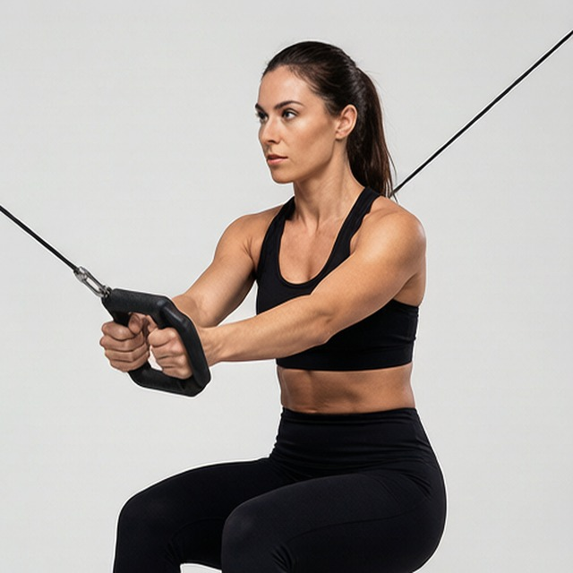

# 绳索俄式转体

**Cable Russian Twists**

> 部位：核心　|　器械：绳索　|　难度：⭐ 新手　|　类型：力量训练 · 复合动作 · 拉

## 目标肌群

- **主要**：腹肌
- **协同**：—

## 肌肉激活示意

🔴 主要肌群　🟠 协同肌群（红/橙块即发力部位，鼠标悬停看名称）

## 动作示意图

|  | 起始位 | 结束位 |
|:---:|:---:|:---:|
| **男性** |  |  |
| **女性** |  |  |

## 动作要点

1. 稳定下半身，骨盆和双脚固定不动——转的是胸椎，不是髋。
2. 核心收紧，脊柱保持中立，不要弓背。
3. 呼气，用腹斜肌带动躯干旋转，眼睛跟随手的方向。
4. 转到有明显侧腹收缩感即可，不追求极限幅度。
5. 吸气缓慢回到中位，再换另一侧，两侧次数保持一致。

## 常见错误

- ❌ 用手臂甩动带动身体 → 腹斜肌不受力
- ❌ 髋部跟着一起转 → 旋转幅度是假的
- ❌ 速度过快 → 腰椎旋转受剪切力
- ✅ 固定骨盆、慢速旋转、两侧对称

## 训练建议

3–5 组 × 6–12 次，组间休息 90–150 秒；先把动作做标准再加重量。

<b>英文原始步骤 / Original Instructions</b>（点击展开）

1. Connect a standard handle attachment, and position the cable to a middle pulley position.
2. Lie on a stability ball perpendicular to the cable and grab the handle with one hand. You should be approximately arm's length away from the pulley, with the tension of the weight on the cable.
3. Grab the handle with both hands and fully extend your arms above your chest. You hands should be directly in-line with the pulley. If not, adjust the pulley up or down until they are.
4. Keep your hips elevated and abs engaged. Rotate your torso away from the pulley for a full-quarter rotation. Your body should be flat from head to knees.
5. Pause for a moment and in a slow and controlled manner reset to the starting position. You should still have side tension on the cable in the resting position.
6. Repeat the same movement to failure.
7. Then, reposition and repeat the same series of movements on the opposite side.

---

[← 返回核心部位索引](README.md)　|　[返回首页](../../README.md)

数据与图片来源：[yuhonas/free-exercise-db](https://github.com/yuhonas/free-exercise-db)（The Unlicense，公有领域）　·　中文名称、动作要点与内容组织：Yue（gengyueworks）