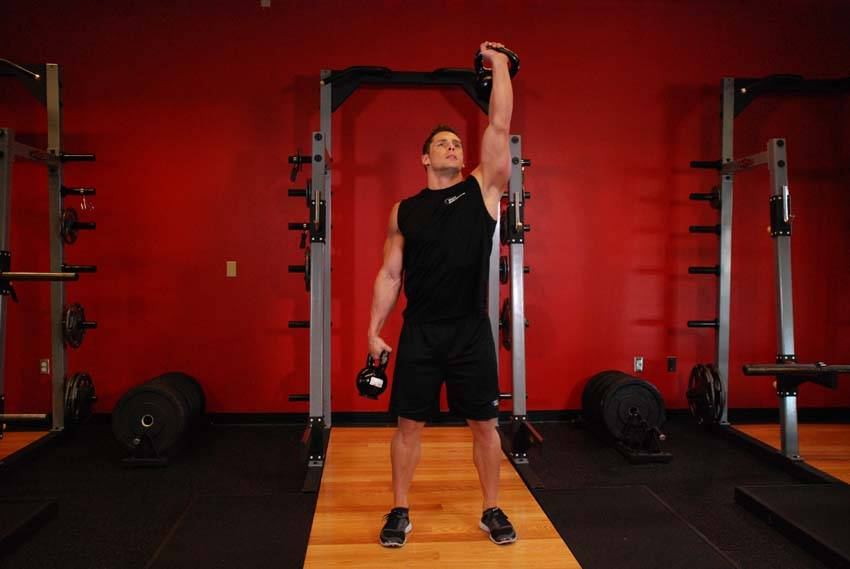
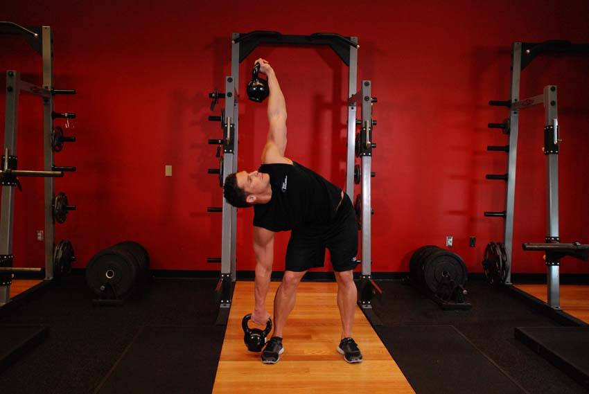

# 双侧壶铃风车式

**Double Kettlebell Windmill**

> 部位：核心　|　器械：壶铃　|　难度：⭐⭐ 进阶　|　类型：力量训练 · — · 拉

## 目标肌群

- **主要**：腹肌
- **协同**：臀大肌、腘绳肌（大腿后侧）、三角肌、肱三头肌

## 动作示意图

| 起始位 | 结束位 |
|:---:|:---:|
|  |  |

## 动作要点

1. 稳定下半身，骨盆和双脚固定不动——转的是胸椎，不是髋。
2. 核心收紧，脊柱保持中立，不要弓背。
3. 呼气，用腹斜肌带动躯干旋转，眼睛跟随手的方向。
4. 转到有明显侧腹收缩感即可，不追求极限幅度。
5. 吸气缓慢回到中位，再换另一侧，两侧次数保持一致。

## 常见错误

- ❌ 用手臂甩动带动身体 → 腹斜肌不受力
- ❌ 髋部跟着一起转 → 旋转幅度是假的
- ❌ 速度过快 → 腰椎旋转受剪切力
- ✅ 固定骨盆、慢速旋转、两侧对称

## 训练建议

3–5 组 × 6–12 次，组间休息 90–150 秒；先把动作做标准再加重量。

<b>英文原始步骤 / Original Instructions</b>（点击展开）

1. Place a kettlebell in front of your front foot and clean and press a kettlebell overhead with your opposite arm. Clean the kettlebell to your shoulder by extending through the legs and hips as you pull the kettlebell towards your shoulders. Rotate your wrist as you do so, so that the palm faces forward.
2. Keeping the kettlebell locked out at all times, push your butt out in the direction of the locked out kettlebell. Turn your feet out at a forty-five degree angle from the arm with the locked out kettlebell.
3. Bending at the hip to one side, sticking your butt out, slowly lean until you can retrieve the kettlebell from the floor. Keep your eyes on the kettlebell that you hold over your head at all times.
4. Pause for a second after retrieving the kettlebell from the ground and reverse the motion back to the starting position.

---

[← 返回核心部位索引](README.md)　|　[返回首页](../../README.md)

数据与图片来源：[yuhonas/free-exercise-db](https://github.com/yuhonas/free-exercise-db)（The Unlicense，公有领域）　·　中文名称、动作要点与内容组织：Yue（gengyueworks）
