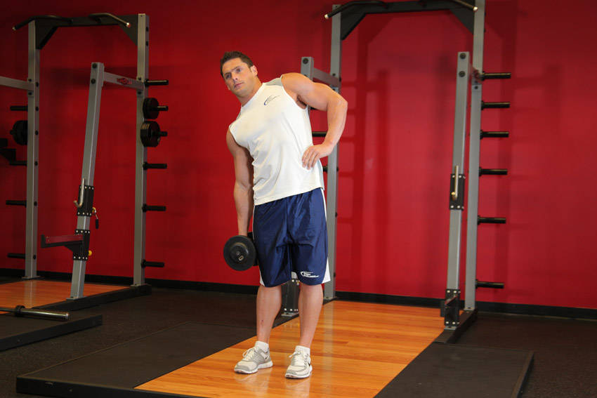
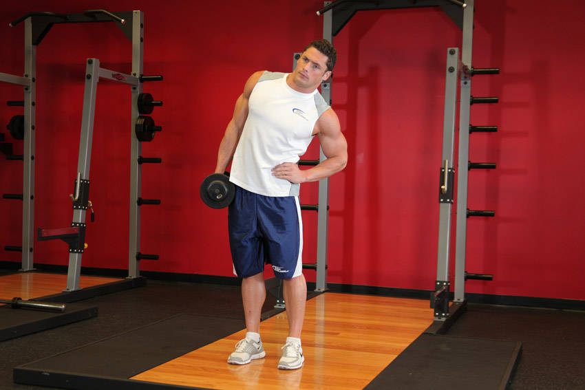

# 哑铃体侧屈

**Dumbbell Side Bend**

> 部位：核心　|　器械：哑铃　|　难度：⭐ 新手　|　类型：力量训练 · 孤立动作 · 拉

## 目标肌群

- **主要**：腹肌
- **协同**：—

## 动作示意图

| 起始位 | 结束位 |
|:---:|:---:|
|  |  |

## 动作要点

1. 稳定下半身，骨盆和双脚固定不动——转的是胸椎，不是髋。
2. 核心收紧，脊柱保持中立，不要弓背。
3. 呼气，用腹斜肌带动躯干旋转，眼睛跟随手的方向。
4. 转到有明显侧腹收缩感即可，不追求极限幅度。
5. 吸气缓慢回到中位，再换另一侧，两侧次数保持一致。

## 常见错误

- ❌ 用手臂甩动带动身体 → 腹斜肌不受力
- ❌ 髋部跟着一起转 → 旋转幅度是假的
- ❌ 速度过快 → 腰椎旋转受剪切力
- ✅ 固定骨盆、慢速旋转、两侧对称

## 训练建议

3–4 组 × 10–15 次，组间休息 45–75 秒；小重量找目标肌群的收缩感。

<b>英文原始步骤 / Original Instructions</b>（点击展开）

1. Stand up straight while holding a dumbbell on the left hand (palms facing the torso) as you have the right hand holding your waist. Your feet should be placed at shoulder width. This will be your starting position.
2. While keeping your back straight and your head up, bend only at the waist to the right as far as possible. Breathe in as you bend to the side. Then hold for a second and come back up to the starting position as you exhale. Tip: Keep the rest of the body stationary.
3. Now repeat the movement but bending to the left instead. Hold for a second and come back to the starting position.
4. Repeat for the recommended amount of repetitions and then change hands.

---

[← 返回核心部位索引](README.md)　|　[返回首页](../../README.md)

数据与图片来源：[yuhonas/free-exercise-db](https://github.com/yuhonas/free-exercise-db)（The Unlicense，公有领域）　·　中文名称、动作要点与内容组织：Yue（gengyueworks）
