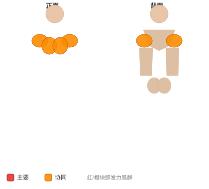

# 奥蒂斯向上

**Otis-Up**

> 部位：核心　|　器械：其他　|　难度：⭐ 新手　|　类型：力量训练 · 复合动作 · 拉

## 目标肌群

- **主要**：腹肌
- **协同**：胸大肌、三角肌、肱三头肌

## 肌肉激活示意

🔴 主要肌群　🟠 协同肌群（红/橙块即发力部位，鼠标悬停看名称）

## 动作示意图

| 起始位 | 结束位 |
|:---:|:---:|
|  |  |

## 动作要点

1. 屈膝仰卧，下背贴紧地面或垫子，双手放在耳侧或交叉抱胸。
2. 呼气，用腹肌把肋骨往骨盆方向「卷」，肩胛离地即可。
3. 注意是脊柱一节节卷起，不是用脖子把头拽起来。
4. 顶峰停顿一秒，主动挤压腹部。
5. 吸气缓慢还原，肩胛落地但腹部保持张力，不要完全松掉。

## 常见错误

- ❌ 双手抱头往前拽 → 颈椎受力，脖子先酸
- ❌ 起身幅度过大变成仰卧起坐 → 髋屈肌主导
- ❌ 靠惯性快速上下 → 腹肌几乎不受力
- ✅ 卷腹不是抬头、幅度小而慢、顶峰挤压

## 训练建议

3–5 组 × 6–12 次，组间休息 90–150 秒；先把动作做标准再加重量。

<b>英文原始步骤 / Original Instructions</b>（点击展开）

1. Secure your feet and lay back on the floor. Your knees should be bent. Hold a weight with both hands to your chest. This will be your starting position.
2. Initiate the movement by flexing the hips and spine to raise your torso up from the ground.
3. As you move up, press the weight up so that it is above your head at the top of the movement.
4. Return the weight to your chest as you reverse the sit-up motion, ensuring not to go all the way down to the floor.

---

[← 返回核心部位索引](README.md)　|　[返回首页](../../README.md)

数据与图片来源：[yuhonas/free-exercise-db](https://github.com/yuhonas/free-exercise-db)（The Unlicense，公有领域）　·　中文名称、动作要点与内容组织：Yue（gengyueworks）