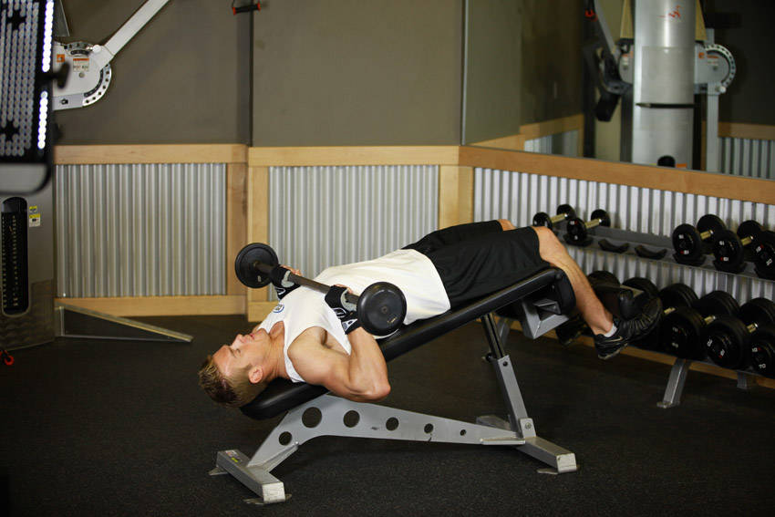
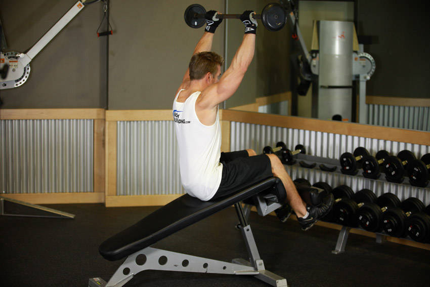

# 推举仰卧起坐

**Press Sit-Up**

> 部位：核心　|　器械：杠铃　|　难度：⭐⭐⭐ 高手　|　类型：力量训练 · 复合动作 · 推

## 目标肌群

- **主要**：腹肌
- **协同**：胸大肌、三角肌、肱三头肌

## 动作示意图

| 起始位 | 结束位 |
|:---:|:---:|
|  |  |

## 动作要点

1. 握住杠铃，起始位置在锁骨/下巴高度，手腕在手肘正上方。
2. 核心和臀部收紧，肋骨不要外翻，避免用腰代偿。
3. 呼气竖直向上推，过头后手臂位于耳侧或略靠后。
4. 顶端肩胛骨自然上回旋，手肘不完全锁死。
5. 吸气沿原轨迹控制下放到起始位，不要砸下来。

## 常见错误

- ❌ 挺腰后仰把肩推变成上斜卧推 → 腰椎吃力
- ❌ 杠铃走「之」字绕过下巴 → 轨迹低效
- ❌ 手腕后折 → 腕关节疼痛
- ✅ 收紧核心、直上直下、手腕中立

## 训练建议

3–5 组 × 6–12 次，组间休息 90–150 秒；先把动作做标准再加重量。

<b>英文原始步骤 / Original Instructions</b>（点击展开）

1. To begin, lie down on a bench with a barbell resting on your chest. Position your legs so they are secure on the extension of the abdominal bench. This is the starting position.
2. While inhaling, tighten your abdominals and glutes. Simultaneously curl your torso as you do when performing a sit-up and press the barbell to an overhead position while exhaling. Tip: Use your arms to push the barbell out as you perform this exercise while still focusing on the abdominal muscles.
3. Lower your upper body back down to the starting position while bringing the barbell back down to your torso. Remember to breathe in while lowering the body.
4. Repeat for the recommended amount of repetitions.

---

[← 返回核心部位索引](README.md)　|　[返回首页](../../README.md)

数据与图片来源：[yuhonas/free-exercise-db](https://github.com/yuhonas/free-exercise-db)（The Unlicense，公有领域）　·　中文名称、动作要点与内容组织：Yue（gengyueworks）
