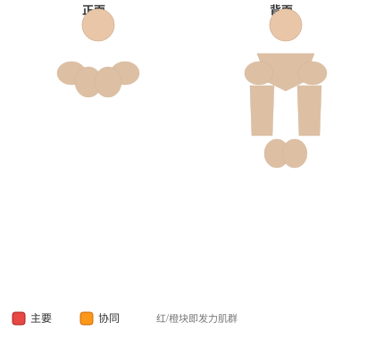

# 俄罗斯转体

**Russian Twist**

> 部位：核心　|　器械：自重　|　难度：⭐⭐ 进阶　|　类型：力量训练 · 复合动作 · 拉

## 目标肌群

- **主要**：腹肌
- **协同**：下背（竖脊肌）

## 肌肉激活示意

🔴 主要肌群　🟠 协同肌群（红/橙块即发力部位，鼠标悬停看名称）

## 动作示意图

| 起始位 | 结束位 |
|:---:|:---:|
|  |  |

## 动作要点

1. 稳定下半身，骨盆和双脚固定不动——转的是胸椎，不是髋。
2. 核心收紧，脊柱保持中立，不要弓背。
3. 呼气，用腹斜肌带动躯干旋转，眼睛跟随手的方向。
4. 转到有明显侧腹收缩感即可，不追求极限幅度。
5. 吸气缓慢回到中位，再换另一侧，两侧次数保持一致。

## 常见错误

- ❌ 用手臂甩动带动身体 → 腹斜肌不受力
- ❌ 髋部跟着一起转 → 旋转幅度是假的
- ❌ 速度过快 → 腰椎旋转受剪切力
- ✅ 固定骨盆、慢速旋转、两侧对称

## 训练建议

3–5 组 × 6–12 次，组间休息 90–150 秒；先把动作做标准再加重量。

<b>英文原始步骤 / Original Instructions</b>（点击展开）

1. Lie down on the floor placing your feet either under something that will not move or by having a partner hold them. Your legs should be bent at the knees.
2. Elevate your upper body so that it creates an imaginary V-shape with your thighs. Your arms should be fully extended in front of you perpendicular to your torso and with the hands clasped. This is the starting position.
3. Twist your torso to the right side until your arms are parallel with the floor while breathing out.
4. Hold the contraction for a second and move back to the starting position while breathing out. Now move to the opposite side performing the same techniques you applied to the right side.
5. Repeat for the recommended amount of repetitions.

---

[← 返回核心部位索引](README.md)　|　[返回首页](../../README.md)

数据与图片来源：[yuhonas/free-exercise-db](https://github.com/yuhonas/free-exercise-db)（The Unlicense，公有领域）　·　中文名称、动作要点与内容组织：Yue（gengyueworks）