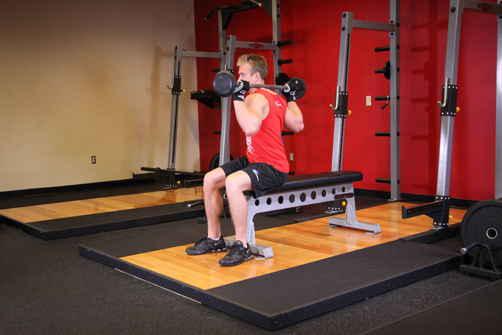
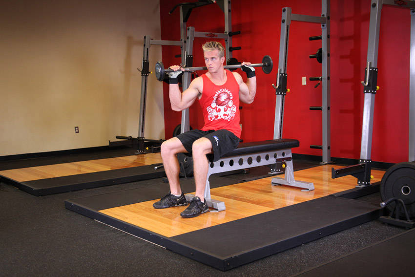

# 坐姿杠铃转体

**Seated Barbell Twist**

> 部位：核心　|　器械：杠铃　|　难度：⭐ 新手　|　类型：力量训练 · 孤立动作 · 拉

## 目标肌群

- **主要**：腹肌
- **协同**：—

## 肌肉激活示意

🔴 主要肌群　🟠 协同肌群（红/橙块即发力部位，鼠标悬停看名称）

## 动作示意图

| 起始位 | 结束位 |
|:---:|:---:|
|  |  |

## 动作要点

1. 坐姿稳定下半身，骨盆和双脚固定不动——转的是胸椎，不是髋。
2. 核心收紧，脊柱保持中立，不要弓背。
3. 呼气，用腹斜肌带动躯干旋转，眼睛跟随手的方向。
4. 转到有明显侧腹收缩感即可，不追求极限幅度。
5. 吸气缓慢回到中位，再换另一侧，两侧次数保持一致。

## 常见错误

- ❌ 用手臂甩动带动身体 → 腹斜肌不受力
- ❌ 髋部跟着一起转 → 旋转幅度是假的
- ❌ 速度过快 → 腰椎旋转受剪切力
- ✅ 固定骨盆、慢速旋转、两侧对称

## 训练建议

3–4 组 × 10–15 次，组间休息 45–75 秒；小重量找目标肌群的收缩感。

<b>英文原始步骤 / Original Instructions</b>（点击展开）

1. Start out by sitting at the end of a flat bench with a barbell placed on top of your thighs. Your feet should be shoulder width apart from each other.
2. Grip the bar with your palms facing down and make sure your hands are wider than shoulder width apart from each other. Begin to lift the barbell up over your head until your arms are fully extended.
3. Now lower the barbell behind your head until it is resting along the base of your neck. This is the starting position.
4. While keeping your feet and head stationary, move your waist from side to side so that your oblique muscles feel the contraction. Only move from side to side as far as your waist will allow you to go. Stretching or moving too far can cause an injury to occur. Tip: Use a slow and controlled motion.
5. Remember to breathe out while twisting your body to the side and in when moving back to the starting position.
6. Repeat for the recommended amount of repetitions.

---

[← 返回核心部位索引](README.md)　|　[返回首页](../../README.md)

数据与图片来源：[yuhonas/free-exercise-db](https://github.com/yuhonas/free-exercise-db)（The Unlicense，公有领域）　·　中文名称、动作要点与内容组织：Yue（gengyueworks）