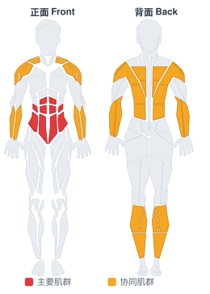

# 大锤砸击摆荡

**Sledgehammer Swings**

> 部位：核心　|　器械：其他　|　难度：⭐ 新手　|　类型：爆发力/弹跳 · 复合动作 · 拉

## 目标肌群

- **主要**：腹肌
- **协同**：小腿（腓肠肌/比目鱼肌）、前臂、背阔肌、中背（菱形肌/斜方肌中束）、三角肌

## 肌肉激活示意

🔴 主要肌群　🟠 协同肌群（红/橙块即发力部位，鼠标悬停看名称）

## 动作示意图

| 起始位 | 结束位 |
|:---:|:---:|
|  |  |

## 动作要点

1. 力量人项目对场地、器材和保护要求高，务必确认环境安全。
2. 起始动作与硬拉一致：屈髋屈膝、挺胸、背部中立、核心绷紧。
3. 发力时髋腿主导，全身作为一个整体输出，避免局部代偿。
4. 全程保持呼吸节奏，重负荷下不要长时间憋气。
5. 结束时有控制地放下器械，不要直接甩手。

## 常见错误

- ❌ 弓背发力 → 腰椎损伤
- ❌ 无人保护挑战极限重量 → 安全隐患
- ❌ 技术不熟就加重量 → 事故高发
- ✅ 先练技术、确保保护、整体发力

## 训练建议

3–5 组 × 3–6 次，组间充分休息 2–3 分钟；追求每一次的质量，疲劳后立即停止。

<b>英文原始步骤 / Original Instructions</b>（点击展开）

1. You will need a tire and a sledgehammer for this exercise. Stand in front of the tire about two feet away from it with a staggered stance. Grip the sledgehammer.
2. If you are right handed, your left hand should be at the bottom of the handle, and your right hand should be choking up closer to the head.
3. As you bring the sledge up, your right hand slides toward the head; as you swing down, your right hand will slide down to join your left hand. Slam it down as hard as you can against the tire. Control the bounce of the hammer off of the tire.
4. Repeat on the other side.

---

[← 返回核心部位索引](README.md)　|　[返回首页](../../README.md)

数据与图片来源：[yuhonas/free-exercise-db](https://github.com/yuhonas/free-exercise-db)（The Unlicense，公有领域）　·　中文名称、动作要点与内容组织：Yue（gengyueworks）