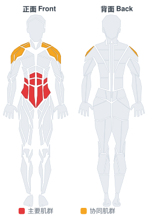

# 站姿绳索伐木式转体

**Standing Cable Wood Chop**

> 部位：核心　|　器械：绳索　|　难度：⭐ 新手　|　类型：力量训练 · 复合动作 · 拉

## 目标肌群

- **主要**：腹肌
- **协同**：三角肌

## 肌肉激活示意

🔴 主要肌群　🟠 协同肌群（红/橙块即发力部位，鼠标悬停看名称）

## 动作示意图

| 起始位 | 结束位 |
|:---:|:---:|
|  |  |

## 动作要点

1. 充分热身后再做——爆发类动作对关节和肌腱要求高。
2. 起跳前屈髋屈膝下蹲蓄力，手臂自然后摆，核心收紧。
3. 快速有力地伸髋伸膝蹬地，手臂同时向上摆动带动身体。
4. 落地时前脚掌先着地，随即屈髋屈膝缓冲，像「轻轻落下」而不是砸下去。
5. 组间充分休息，质量优先于次数——动作变形就该停了。

## 常见错误

- ❌ 落地膝盖内扣 → 韧带损伤风险最高
- ❌ 落地直腿硬砸 → 冲击全给膝踝关节
- ❌ 疲劳状态下继续冲次数 → 爆发力训练最忌讳
- ✅ 充分热身、软着陆、宁少勿滥

## 训练建议

3–5 组 × 6–12 次，组间休息 90–150 秒；先把动作做标准再加重量。

<b>英文原始步骤 / Original Instructions</b>（点击展开）

1. Connect a standard handle to a tower, and move the cable to the highest pulley position.
2. With your side to the cable, grab the handle with one hand and step away from the tower. You should be approximately arm's length away from the pulley, with the tension of the weight on the cable. Your outstretched arm should be aligned with the cable.
3. With your feet positioned shoulder width apart, reach upward with your other hand and grab the handle with both hands. Your arms should still be fully extended.
4. In one motion, pull the handle down and across your body to your front knee while rotating your torso.
5. Keep your back and arms straight and core tight while you pivot your back foot and bend your knees to get a full range of motion.
6. Maintain your stance and straight arms. Return to the neutral position in a slow and controlled manner.
7. Repeat to failure.
8. Then, reposition and repeat the same series of movements on the opposite side.

---

[← 返回核心部位索引](README.md)　|　[返回首页](../../README.md)

数据与图片来源：[yuhonas/free-exercise-db](https://github.com/yuhonas/free-exercise-db)（The Unlicense，公有领域）　·　中文名称、动作要点与内容组织：Yue（gengyueworks）