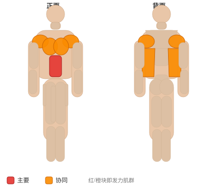

# 仰卧双臂过顶抛掷

**Supine Two-Arm Overhead Throw**

> 部位：核心　|　器械：药球　|　难度：⭐ 新手　|　类型：爆发力/弹跳 · 复合动作 · 拉

## 目标肌群

- **主要**：腹肌
- **协同**：胸大肌、背阔肌、三角肌

## 肌肉激活示意

🔴 主要肌群　🟠 协同肌群（红/橙块即发力部位，鼠标悬停看名称）

## 动作示意图

| 起始位 | 结束位 |
|:---:|:---:|
|  |  |

## 动作要点

1. 仰卧握住药球，脊柱保持中立，核心收紧，避免弓背。
2. 起始时让肩胛骨自然前伸，背阔肌被拉长。
3. 呼气，先收肩胛再用手肘向后拉，把药球带向腹部或下肋位置。
4. 顶峰挤压背部一秒，两侧肩胛向中间夹紧。
5. 吸气缓慢还原，全程躯干稳定不摇摆。

## 常见错误

- ❌ 弓背拉重量 → 腰椎受伤风险最高的错误
- ❌ 靠躯干起伏甩上来 → 背部没吃上力
- ❌ 手肘外展太多 → 变成练后束而非背阔肌
- ✅ 中立脊柱、先收肩胛、肘贴身后拉

## 训练建议

3–5 组 × 3–6 次，组间充分休息 2–3 分钟；追求每一次的质量，疲劳后立即停止。

<b>英文原始步骤 / Original Instructions</b>（点击展开）

1. Lay on the ground on your back with your knees bent.
2. Hold the ball with both hands, extending the arms fully behind your head. This will be your starting position.
3. Initiate the movement at the shoulder, throwing the ball directly forward of you as you sit up, attempting to go for maximum distance.
4. The ball can be thrown to a partner or bounced off of a wall.

---

[← 返回核心部位索引](README.md)　|　[返回首页](../../README.md)

数据与图片来源：[yuhonas/free-exercise-db](https://github.com/yuhonas/free-exercise-db)（The Unlicense，公有领域）　·　中文名称、动作要点与内容组织：Yue（gengyueworks）