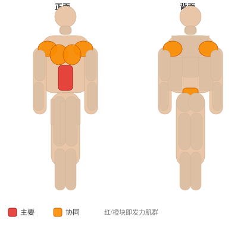

# 悬吊前推伸展

**Suspended Fallout**

> 部位：核心　|　器械：其他　|　难度：⭐⭐ 进阶　|　类型：力量训练 · 孤立动作 · 拉

## 目标肌群

- **主要**：腹肌
- **协同**：胸大肌、下背（竖脊肌）、三角肌

## 肌肉激活示意

🔴 主要肌群　🟠 协同肌群（红/橙块即发力部位，鼠标悬停看名称）

## 动作示意图

| 起始位 | 结束位 |
|:---:|:---:|
|  |  |

## 动作要点

1. 前臂或手掌撑地，肘关节在肩正下方，双脚与髋同宽。
2. 收紧核心和臀部，让肩、髋、踝连成一条直线。
3. 骨盆微微后倾（想象把尾骨往下夹），消除腰部塌陷。
4. 保持均匀呼吸，不要憋气，眼睛看向双手之间的地面。
5. 以能保持标准姿势的时间为准，姿势一变形就结束这一组。

## 常见错误

- ❌ 塌腰 → 腰椎承受压力，核心反而没练到
- ❌ 撅臀 → 降低难度、核心卸力
- ❌ 憋气硬撑 → 血压升高且撑不久
- ✅ 一条直线、收紧臀部、正常呼吸

## 训练建议

3–4 组 × 10–15 次，组间休息 45–75 秒；小重量找目标肌群的收缩感。

<b>英文原始步骤 / Original Instructions</b>（点击展开）

1. Adjust the straps so the handles are at an appropriate height, below waist level.
2. Begin standing and grasping the handles. Lean into the straps, moving to an incline push-up position. This will be your starting position.
3. Keeping your arms straight, lean further into the suspension straps, bringing your body closer to the ground, allowing your shoulders to extend, raising your arms up and over your head.
4. Maintain a neutral spine and keep the rest of your body straight, your shoulders being the only joints allowed to move.
5. Pause during the peak contraction, and then return to the starting position.

---

[← 返回核心部位索引](README.md)　|　[返回首页](../../README.md)

数据与图片来源：[yuhonas/free-exercise-db](https://github.com/yuhonas/free-exercise-db)（The Unlicense，公有领域）　·　中文名称、动作要点与内容组织：Yue（gengyueworks）