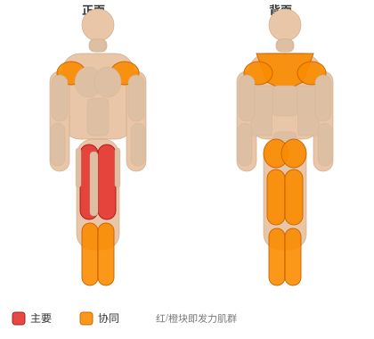
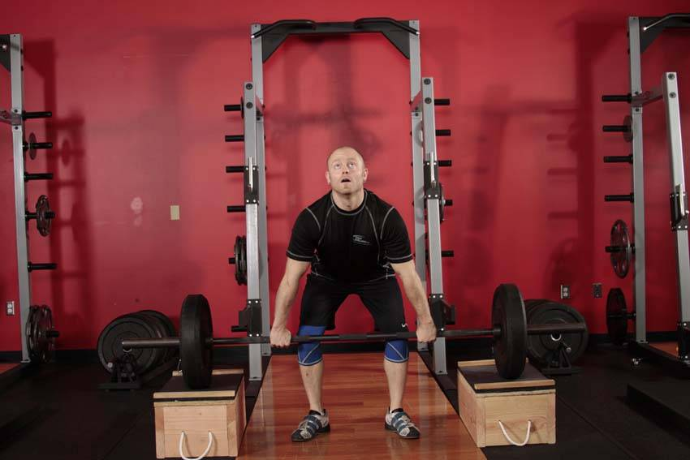

# 翻站台块

**Clean from Blocks**

> 部位：全身　|　器械：杠铃　|　难度：⭐⭐ 进阶　|　类型：奥林匹克举重 · 复合动作 · 拉

## 目标肌群

- **主要**：股四头肌（大腿前侧）
- **协同**：小腿（腓肠肌/比目鱼肌）、臀大肌、腘绳肌（大腿后侧）、三角肌、斜方肌

## 肌肉激活示意

🔴 主要肌群　🟠 协同肌群（红/橙块即发力部位，鼠标悬停看名称）

## 动作示意图

| 起始位 | 结束位 |
|:---:|:---:|
|  |  |

## 动作要点

1. 这是技术性极高的举重动作，强烈建议先在教练指导下用空杆学习动作模式。
2. 起始姿势：杠贴小腿，挺胸收肩胛，背部中立，核心绷紧。
3. 第一发力：用腿把杠「推离」地面，保持背角不变，杠贴腿上行。
4. 第二发力：过膝后爆发式伸髋伸膝、耸肩提肘，把杠加速向上。
5. 接杠：迅速下潜到接杠位置稳住，站起完成，然后有控制地放下杠铃。

## 常见错误

- ❌ 用手臂拉杠 → 手臂只负责传导，发力靠髋腿
- ❌ 杠远离身体走弧线 → 力臂变大，几乎必失败
- ❌ 未掌握技术就上大重量 → 受伤风险极高
- ✅ 空杆练技术、杠贴身走、髋腿主导发力

## 训练建议

5–6 组 × 2–3 次，组间休息 2–3 分钟；技术优先，宁轻勿重。

<b>英文原始步骤 / Original Instructions</b>（点击展开）

1. With a barbell on boxes or stands of the desired height, take an overhand or hook grip just outside the legs. Lower your hips with the weight focused on the heels, back straight, head facing forward, chest up, with your shoulders just in front of the bar. This will be your starting position.
2. Begin the first pull by driving through the heels, extending your knees. Your back angle should stay the same, and your arms should remain straight with the elbows pointed out.
3. As full extension is achieved, transition into the receiving position by aggressively shrugging and flexing the arms with the elbows up and out. Aggressively pull yourself down, rotating your elbows under the bar as you do so. Receive the bar in a front squat position, the depth of which is dependent upon the height of the bar at the end of the third pull. The bar should be racked onto the protracted shoulders, lightly touching the throat with the hands relaxed. Continue to descend to the bottom squat position, which will help in the recovery.
4. Immediately recover by driving through the heels, keeping the torso upright and elbows up. Continue until you have risen to a standing position. Return the weight to the boxes for the next rep.

---

[← 返回全身部位索引](README.md)　|　[返回首页](../../README.md)

数据与图片来源：[yuhonas/free-exercise-db](https://github.com/yuhonas/free-exercise-db)（The Unlicense，公有领域）　·　中文名称、动作要点与内容组织：Yue（gengyueworks）