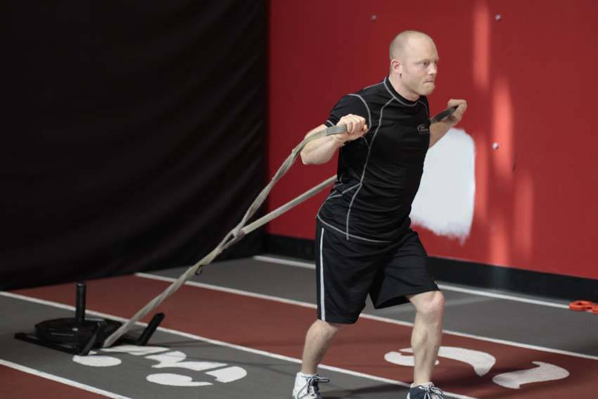

# 向前拖行（推举）

**Forward Drag with Press**

> 部位：全身　|　器械：其他　|　难度：⭐⭐ 进阶　|　类型：力量人训练 · 复合动作 · 推

## 目标肌群

- **主要**：胸大肌
- **协同**：小腿（腓肠肌/比目鱼肌）、臀大肌、腘绳肌（大腿后侧）、股四头肌（大腿前侧）、三角肌、肱三头肌

## 动作示意图

| 起始位 | 结束位 |
|:---:|:---:|
|  |  |

## 动作要点

1. 握住器械，起始位置在锁骨/下巴高度，手腕在手肘正上方。
2. 核心和臀部收紧，肋骨不要外翻，避免用腰代偿。
3. 呼气竖直向上推，过头后手臂位于耳侧或略靠后。
4. 顶端肩胛骨自然上回旋，手肘不完全锁死。
5. 吸气沿原轨迹控制下放到起始位，不要砸下来。

## 常见错误

- ❌ 挺腰后仰把肩推变成上斜卧推 → 腰椎吃力
- ❌ 杠铃走「之」字绕过下巴 → 轨迹低效
- ❌ 手腕后折 → 腕关节疼痛
- ✅ 收紧核心、直上直下、手腕中立

## 训练建议

3–5 组，按距离（20–30 米）或时间（30–60 秒）计；组间充分休息。

<b>英文原始步骤 / Original Instructions</b>（点击展开）

1. Attach a dual handled chain or rope attachment to the sled. You should be facing away from the sled, holding a handle in each hand.
2. Begin the movement by moving forward for one step. Leaning forward, extend through the legs and hips to move, pausing with each step to extend through the elbows, pressing your hands forward. Step forward until you return to the start position prepared to press.

---

[← 返回全身部位索引](README.md)　|　[返回首页](../../README.md)

数据与图片来源：[yuhonas/free-exercise-db](https://github.com/yuhonas/free-exercise-db)（The Unlicense，公有领域）　·　中文名称、动作要点与内容组织：Yue（gengyueworks）
