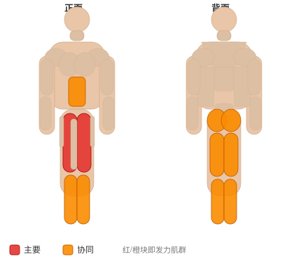

# 前平举式深蹲

**Frankenstein Squat**

> 部位：全身　|　器械：杠铃　|　难度：⭐⭐ 进阶　|　类型：奥林匹克举重 · 复合动作 · 推

## 目标肌群

- **主要**：股四头肌（大腿前侧）
- **协同**：腹肌、小腿（腓肠肌/比目鱼肌）、臀大肌、腘绳肌（大腿后侧）

## 肌肉激活示意

🔴 主要肌群　🟠 协同肌群（红/橙块即发力部位，鼠标悬停看名称）

## 动作示意图

| 起始位 | 结束位 |
|:---:|:---:|
|  |  |

## 动作要点

1. 杠铃稳定在背部斜方肌上（或按动作要求持握），双脚与肩同宽、脚尖略外展。
2. 吸气、核心收紧，想象「用腹部顶住一条腰带」再下蹲。
3. 髋部先向后向下坐，膝盖始终朝脚尖方向打开，不要内扣。
4. 蹲到大腿与地面平行或更低（以能保持腰背中立为准）。
5. 呼气蹬地起身，全脚掌发力，顶端髋部前顶，膝盖不锁死。

## 常见错误

- ❌ 膝盖内扣 → 半月板和韧带受损的首要原因
- ❌ 脚跟离地 → 重心前移，压力全给膝盖前侧
- ❌ 底部弓腰（俗称「屁股眨眼」） → 腰椎受剪切力
- ✅ 膝盖跟脚尖同向、全脚掌踩实、核心全程绷住

## 训练建议

5–6 组 × 2–3 次，组间休息 2–3 分钟；技术优先，宁轻勿重。

<b>英文原始步骤 / Original Instructions</b>（点击展开）

1. This drill teaches you the proper positioning of both the bar and your body during the clean and front squat.
2. Place the barbell on the front of the shoulders, releasing your grip and extending your arms out in front of you. The shoulders should be pushed forward to create a shelf, and the bar should be in contact with the throat. Ensure that you only move your shoulder blades forward; don't round the thoracic spine.
3. Squat by flexing the knees and hips, sitting in between your legs. Keep the torso upright, the arms up, and the shoulders forward, and the bar should stay in place. Go to the bottom of the squat, until your hamstrings contact your calves.
4. Return to the upright position by driving through the front of the heel and extending the knees and hips.

---

[← 返回全身部位索引](README.md)　|　[返回首页](../../README.md)

数据与图片来源：[yuhonas/free-exercise-db](https://github.com/yuhonas/free-exercise-db)（The Unlicense，公有领域）　·　中文名称、动作要点与内容组织：Yue（gengyueworks）