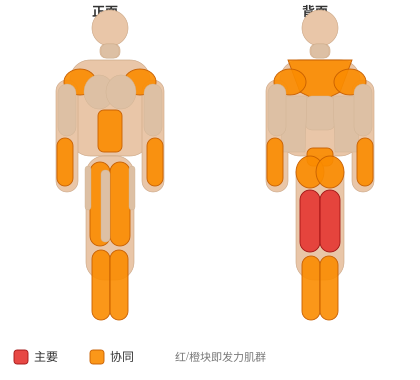
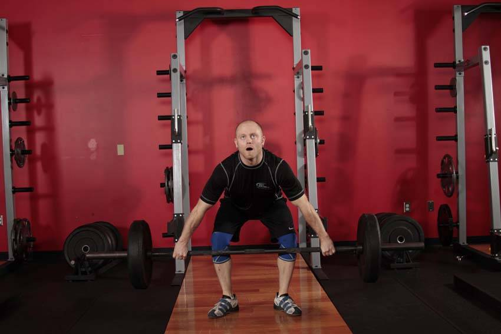

# 悬垂抓举（下方膝）

**Hang Snatch - Below Knees**

> 部位：全身　|　器械：杠铃　|　难度：⭐⭐⭐ 高手　|　类型：奥林匹克举重 · 复合动作 · 拉

## 目标肌群

- **主要**：腘绳肌（大腿后侧）
- **协同**：腹肌、小腿（腓肠肌/比目鱼肌）、前臂、臀大肌、下背（竖脊肌）、股四头肌（大腿前侧）、三角肌、斜方肌

## 肌肉激活示意

🔴 主要肌群　🟠 协同肌群（红/橙块即发力部位，鼠标悬停看名称）

## 动作示意图

| 起始位 | 结束位 |
|:---:|:---:|
|  |  |

## 动作要点

1. 这是技术性极高的举重动作，强烈建议先在教练指导下用空杆学习动作模式。
2. 起始姿势：杠贴小腿，挺胸收肩胛，背部中立，核心绷紧。
3. 第一发力：用腿把杠「推离」地面，保持背角不变，杠贴腿上行。
4. 第二发力：过膝后爆发式伸髋伸膝、耸肩提肘，把杠加速向上。
5. 接杠：迅速下潜到接杠位置稳住，站起完成，然后有控制地放下杠铃。

## 常见错误

- ❌ 用手臂拉杠 → 手臂只负责传导，发力靠髋腿
- ❌ 杠远离身体走弧线 → 力臂变大，几乎必失败
- ❌ 未掌握技术就上大重量 → 受伤风险极高
- ✅ 空杆练技术、杠贴身走、髋腿主导发力

## 训练建议

5–6 组 × 2–3 次，组间休息 2–3 分钟；技术优先，宁轻勿重。

<b>英文原始步骤 / Original Instructions</b>（点击展开）

1. Begin with a wide grip on the bar, with an overhand or hook grip. The feet should be directly below the hips with the feet turned out. Your knees should be slightly bent, and the torso inclined forward. The spine should be fully extended and the head facing forward. The bar should be just below the knees. This will be your starting position.
2. Aggressively extend through the legs and hips. At peak extension, shrug the shoulders and allow the elbows to flex to the side.
3. As you move your feet into the receiving position, forcefully pull yourself below the bar as you elevate the bar overhead. Receive the bar with your body as low as possible and the arms fully extended overhead.
4. Return to a standing position with the weight overhead, and then return the weight to the floor under control.

---

[← 返回全身部位索引](README.md)　|　[返回首页](../../README.md)

数据与图片来源：[yuhonas/free-exercise-db](https://github.com/yuhonas/free-exercise-db)（The Unlicense，公有领域）　·　中文名称、动作要点与内容组织：Yue（gengyueworks）