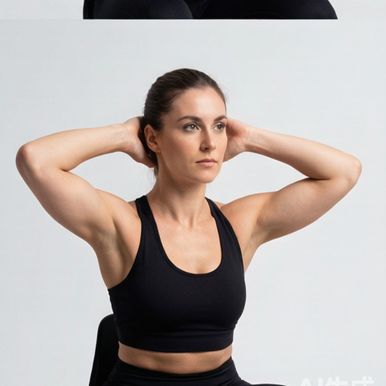

# 静力颈（前侧背）

**Isometric Neck Exercise - Front And Back**

> 部位：全身　|　器械：自重　|　难度：⭐ 新手　|　类型：力量训练 · 孤立动作 · 静态支撑

## 目标肌群

- **主要**：颈部
- **协同**：—

## 肌肉激活示意

🔴 主要肌群　🟠 协同肌群（红/橙块即发力部位，鼠标悬停看名称）

## 动作示意图

|  | 起始位 | 结束位 |
|:---:|:---:|:---:|
| **男性** |  |  |
| **女性** |  |  |

## 动作要点

1. 颈部训练务必从极小的负荷开始，宁轻勿重。
2. 保持脊柱中立，肩膀放松下沉。
3. 在可控范围内缓慢完成屈伸或侧屈，全程无痛。
4. 每个方向停顿 1–2 秒，用 3 秒以上的时间还原。
5. 出现任何头晕、麻木或放射性疼痛立即停止。

## 常见错误

- ❌ 快速甩动脖子 → 颈椎风险极高
- ❌ 使用较大负荷 → 颈部肌群很小，容易拉伤
- ❌ 忍痛继续 → 颈椎问题不可逆
- ✅ 极小负荷、极慢速度、无痛原则

## 训练建议

3–4 组 × 10–15 次，组间休息 45–75 秒；小重量找目标肌群的收缩感。

<b>英文原始步骤 / Original Instructions</b>（点击展开）

1. With your head and neck in a neutral position (normal position with head erect facing forward), place both of your hands on the front side of your head.
2. Now gently push forward as you contract the neck muscles but resisting any movement of your head. Start with slow tension and increase slowly. Keep breathing normally as you execute this contraction.
3. Hold for the recommended number of seconds.
4. Now release the tension slowly.
5. Rest for the recommended amount of time and repeat with your hands placed on the back side of your head.

---

[← 返回全身部位索引](README.md)　|　[返回首页](../../README.md)

数据与图片来源：[yuhonas/free-exercise-db](https://github.com/yuhonas/free-exercise-db)（The Unlicense，公有领域）　·　中文名称、动作要点与内容组织：Yue（gengyueworks）