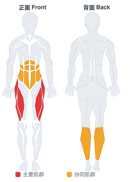
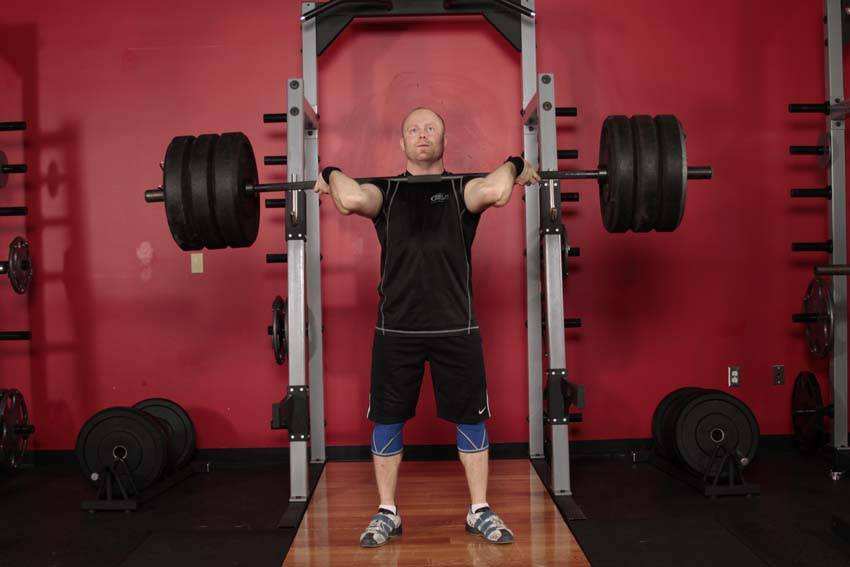
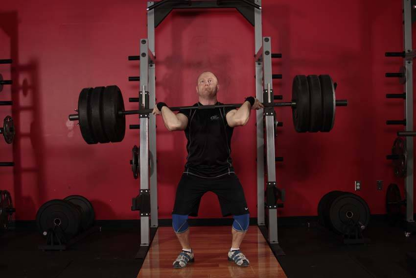

# 挺举臂屈伸深蹲

**Jerk Dip Squat**

> 部位：全身　|　器械：杠铃　|　难度：⭐⭐ 进阶　|　类型：奥林匹克举重 · 复合动作 · 推

## 目标肌群

- **主要**：股四头肌（大腿前侧）
- **协同**：腹肌、小腿（腓肠肌/比目鱼肌）

## 肌肉激活示意

🔴 主要肌群　🟠 协同肌群（红/橙块即发力部位，鼠标悬停看名称）

## 动作示意图

| 起始位 | 结束位 |
|:---:|:---:|
|  |  |

## 动作要点

1. 这是技术性极高的举重动作，强烈建议先在教练指导下用空杆学习动作模式。
2. 起始姿势：杠贴小腿，挺胸收肩胛，背部中立，核心绷紧。
3. 第一发力：用腿把杠「推离」地面，保持背角不变，杠贴腿上行。
4. 第二发力：过膝后爆发式伸髋伸膝、耸肩提肘，把杠加速向上。
5. 接杠：迅速下潜到接杠位置稳住，站起完成，然后有控制地放下杠铃。

## 常见错误

- ❌ 用手臂拉杠 → 手臂只负责传导，发力靠髋腿
- ❌ 杠远离身体走弧线 → 力臂变大，几乎必失败
- ❌ 未掌握技术就上大重量 → 受伤风险极高
- ✅ 空杆练技术、杠贴身走、髋腿主导发力

## 训练建议

5–6 组 × 2–3 次，组间休息 2–3 分钟；技术优先，宁轻勿重。

<b>英文原始步骤 / Original Instructions</b>（点击展开）

1. This movement strengthens the dip portion of the jerk. Begin with the bar racked in the jerk position, with the shoulders forward to create a shelf and the bar lightly contacting the throat. The feet should be directly under the hips, with the feet turned out as is comfortable.
2. Keeping the torso vertical, dip by flexing the knees, allowing them to travel forward and without moving the hips to the rear. The dip should not be excessive. Return the weight to the starting position by driving forcefully though the feet.

---

[← 返回全身部位索引](README.md)　|　[返回首页](../../README.md)

数据与图片来源：[yuhonas/free-exercise-db](https://github.com/yuhonas/free-exercise-db)（The Unlicense，公有领域）　·　中文名称、动作要点与内容组织：Yue（gengyueworks）