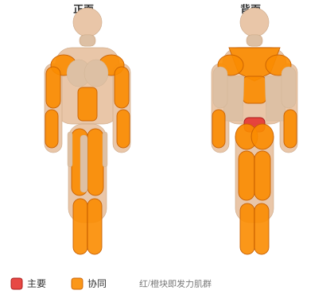

# 酒桶负重

**Keg Load**

> 部位：全身　|　器械：其他　|　难度：⭐⭐ 进阶　|　类型：力量人训练 · 复合动作 · 拉

## 目标肌群

- **主要**：下背（竖脊肌）
- **协同**：腹肌、肱二头肌、小腿（腓肠肌/比目鱼肌）、前臂、臀大肌、腘绳肌（大腿后侧）、中背（菱形肌/斜方肌中束）、股四头肌（大腿前侧）、三角肌、斜方肌

## 肌肉激活示意

🔴 主要肌群　🟠 协同肌群（红/橙块即发力部位，鼠标悬停看名称）

## 动作示意图

| 起始位 | 结束位 |
|:---:|:---:|
|  |  |

## 动作要点

1. 站在负重两侧，屈髋屈膝下去握牢，背部保持中立后站起。
2. 肩膀下沉后收，胸口打开，核心全程绷紧。
3. 小步快走，保持躯干直立，不要左右摇晃。
4. 按距离或时间完成，放下时同样屈髋屈膝，不要弓背丢下。
5. 握力通常先力竭——这本身就是训练效果的一部分。

## 常见错误

- ❌ 弓背拎起或放下 → 腰椎风险
- ❌ 躯干左右大幅摇摆 → 核心失控
- ❌ 步子太大 → 稳定性下降
- ✅ 挺胸沉肩、小步快走、核心绷住

## 训练建议

3–5 组，按距离（20–30 米）或时间（30–60 秒）计；组间充分休息。

<b>英文原始步骤 / Original Instructions</b>（点击展开）

1. To load kegs, place the desired number a distance from the loading platform, typically 30-50 feet.
2. Begin by grabbing the close handle of the first keg, tilting it onto its side to grab the opposite edge of the bottom of the keg. Lift the keg up to your chest.
3. The higher you can place the keg, the faster you should be able to move to the platform. Shouldering is usually not allowed. Be sure to keep a firm hold on the keg. Move as quickly as possible to the platform, and load it, extending through your hips, knees, and ankles to get it as high as possible.
4. Return to the starting position to retrieve the next keg, and repeat until the event is completed.

---

[← 返回全身部位索引](README.md)　|　[返回首页](../../README.md)

数据与图片来源：[yuhonas/free-exercise-db](https://github.com/yuhonas/free-exercise-db)（The Unlicense，公有领域）　·　中文名称、动作要点与内容组织：Yue（gengyueworks）