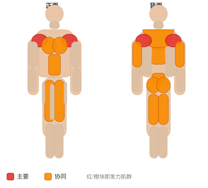

# 圆木提举

**Log Lift**

> 部位：全身　|　器械：其他　|　难度：⭐⭐ 进阶　|　类型：力量人训练 · 复合动作 · 推

## 目标肌群

- **主要**：三角肌
- **协同**：腹肌、胸大肌、臀大肌、腘绳肌（大腿后侧）、下背（竖脊肌）、中背（菱形肌/斜方肌中束）、股四头肌（大腿前侧）、斜方肌、肱三头肌

## 肌肉激活示意

🔴 主要肌群　🟠 协同肌群（红/橙块即发力部位，鼠标悬停看名称）

## 动作示意图

| 起始位 | 结束位 |
|:---:|:---:|
|  |  |

## 动作要点

1. 力量人项目对场地、器材和保护要求高，务必确认环境安全。
2. 起始动作与硬拉一致：屈髋屈膝、挺胸、背部中立、核心绷紧。
3. 发力时髋腿主导，全身作为一个整体输出，避免局部代偿。
4. 全程保持呼吸节奏，重负荷下不要长时间憋气。
5. 结束时有控制地放下器械，不要直接甩手。

## 常见错误

- ❌ 弓背发力 → 腰椎损伤
- ❌ 无人保护挑战极限重量 → 安全隐患
- ❌ 技术不熟就加重量 → 事故高发
- ✅ 先练技术、确保保护、整体发力

## 训练建议

3–5 组，按距离（20–30 米）或时间（30–60 秒）计；组间充分休息。

<b>英文原始步骤 / Original Instructions</b>（点击展开）

1. Begin standing with the log in front of you. Grasp the handles, and begin to clean the log. As you are bent over to start the clean, attempt to get the log as high as possible, pulling it into your chest. Extend through the hips and knees to bring it up to complete the clean.
2. Push your head back and look up, creating a shelf on your chest to rest the log. Begin the press by dipping, flexing slightly through the knees and reversing the motion. This push press will generate momentum to start the log moving vertically. Continue by extending through the elbows to press the log above your head. There are no strict rules on form, so use whatever techniques you are most efficient with. As the log is pressed, ensure that you push your head through on each repetition, looking forward.
3. Repeat as many times as possible. Attempt to control the descent of the log as it is returned to the ground.

---

[← 返回全身部位索引](README.md)　|　[返回首页](../../README.md)

数据与图片来源：[yuhonas/free-exercise-db](https://github.com/yuhonas/free-exercise-db)（The Unlicense，公有领域）　·　中文名称、动作要点与内容组织：Yue（gengyueworks）