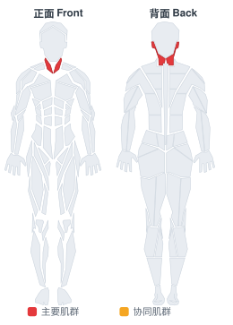
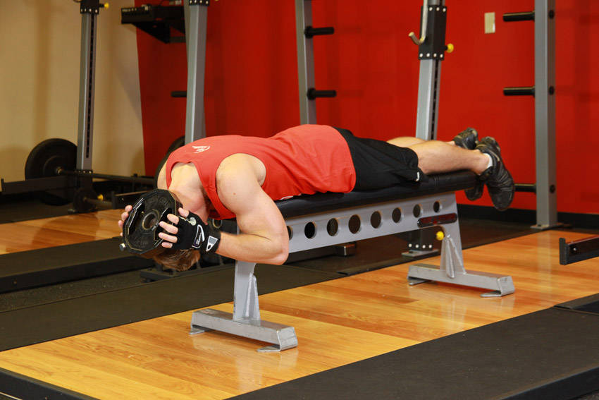

# 仰卧面向向下杠铃片颈抗阻

**Lying Face Down Plate Neck Resistance**

> 部位：全身　|　器械：其他　|　难度：⭐⭐ 进阶　|　类型：力量训练 · 孤立动作 · 拉

## 目标肌群

- **主要**：颈部
- **协同**：—

## 肌肉激活示意

🔴 主要肌群　🟠 协同肌群（红/橙块即发力部位，鼠标悬停看名称）

## 动作示意图

| 起始位 | 结束位 |
|:---:|:---:|
|  |  |

## 动作要点

1. 颈部训练务必从极小的负荷开始，宁轻勿重。
2. 仰卧保持脊柱中立，肩膀放松下沉。
3. 在可控范围内缓慢完成屈伸或侧屈，全程无痛。
4. 每个方向停顿 1–2 秒，用 3 秒以上的时间还原。
5. 出现任何头晕、麻木或放射性疼痛立即停止。

## 常见错误

- ❌ 快速甩动脖子 → 颈椎风险极高
- ❌ 使用较大负荷 → 颈部肌群很小，容易拉伤
- ❌ 忍痛继续 → 颈椎问题不可逆
- ✅ 极小负荷、极慢速度、无痛原则

## 训练建议

3–4 组 × 10–15 次，组间休息 45–75 秒；小重量找目标肌群的收缩感。

<b>英文原始步骤 / Original Instructions</b>（点击展开）

1. Lie face down with your whole body straight on a flat bench while holding a weight plate behind your head. Tip: You will need to position yourself so that your shoulders are slightly above the end of a flat bench in order for the upper chest, neck and face to be off the bench. This will be your starting position.
2. While keeping the plate secure on the back of your head slowly lower your head (as in saying "yes") as you breathe in.
3. Raise your head back up to the starting position in a semi-circular motion as you breathe out. Hold the contraction for a second.
4. Repeat for the recommended amount of repetitions.

---

[← 返回全身部位索引](README.md)　|　[返回首页](../../README.md)

数据与图片来源：[yuhonas/free-exercise-db](https://github.com/yuhonas/free-exercise-db)（The Unlicense，公有领域）　·　中文名称、动作要点与内容组织：Yue（gengyueworks）