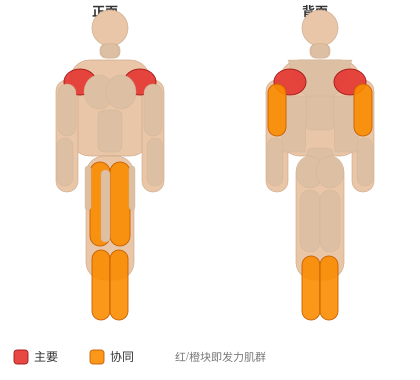
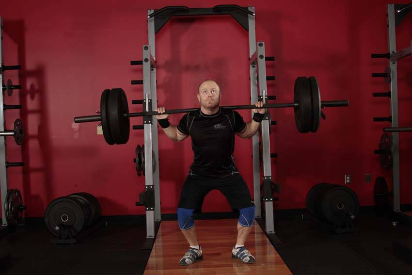

# 借力推举（颈后）

**Push Press - Behind the Neck**

> 部位：全身　|　器械：杠铃　|　难度：⭐⭐ 进阶　|　类型：奥林匹克举重 · 复合动作 · 推

## 目标肌群

- **主要**：三角肌
- **协同**：小腿（腓肠肌/比目鱼肌）、股四头肌（大腿前侧）、肱三头肌

## 肌肉激活示意

🔴 主要肌群　🟠 协同肌群（红/橙块即发力部位，鼠标悬停看名称）

## 动作示意图

| 起始位 | 结束位 |
|:---:|:---:|
|  |  |

## 动作要点

1. 握住杠铃，起始位置在锁骨/下巴高度，手腕在手肘正上方。
2. 核心和臀部收紧，肋骨不要外翻，避免用腰代偿。
3. 呼气竖直向上推，过头后手臂位于耳侧或略靠后。
4. 顶端肩胛骨自然上回旋，手肘不完全锁死。
5. 吸气沿原轨迹控制下放到起始位，不要砸下来。

## 常见错误

- ❌ 挺腰后仰把肩推变成上斜卧推 → 腰椎吃力
- ❌ 杠铃走「之」字绕过下巴 → 轨迹低效
- ❌ 手腕后折 → 腕关节疼痛
- ✅ 收紧核心、直上直下、手腕中立

## 训练建议

5–6 组 × 2–3 次，组间休息 2–3 分钟；技术优先，宁轻勿重。

<b>英文原始步骤 / Original Instructions</b>（点击展开）

1. Standing with the weight racked on the back of the shoulders, begin with the dip. With your feet directly under your hips, flex the knees without moving the hips backward. Go down only slightly, and reverse direction as powerfully as possible. Drive through the heels create as much speed and force as possible, moving the bar in a vertical path.
2. Using the momentum generated, finish pressing the weight overhead be extending through the arms.
3. Return to the starting position, using your legs to absorb the impact.

---

[← 返回全身部位索引](README.md)　|　[返回首页](../../README.md)

数据与图片来源：[yuhonas/free-exercise-db](https://github.com/yuhonas/free-exercise-db)（The Unlicense，公有领域）　·　中文名称、动作要点与内容组织：Yue（gengyueworks）