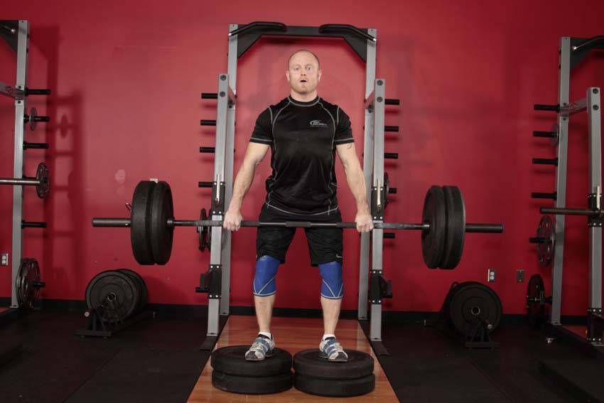
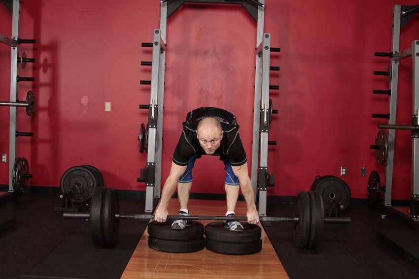

# 垫高罗马尼亚硬拉

**Romanian Deadlift from Deficit**

> 部位：全身　|　器械：杠铃　|　难度：⭐⭐ 进阶　|　类型：奥林匹克举重 · 复合动作 · 拉

## 目标肌群

- **主要**：腘绳肌（大腿后侧）
- **协同**：前臂、臀大肌、下背（竖脊肌）、斜方肌

## 动作示意图

| 起始位 | 结束位 |
|:---:|:---:|
|  |  |

## 动作要点

1. 双脚约与髋同宽，杠铃贴近小腿，杠位于脚掌中部正上方。
2. 屈髋屈膝下去握杠，挺胸收肩胛，背部保持中立——这一步最关键。
3. 吸气憋住核心，先用腿把地面「蹬开」，杠贴着腿向上走。
4. 髋膝同步伸展，过膝后髋部前顶站直，顶端夹紧臀部但不要后仰。
5. 下放时先屈髋把杠沿腿送下去，过膝再屈膝，保持背部中立。

## 常见错误

- ❌ 弓背起杠 → 腰椎间盘压力剧增，最危险的错误
- ❌ 杠离小腿太远 → 力臂变长，腰部代偿
- ❌ 顶端过度后仰 → 腰椎超伸，没有额外收益
- ✅ 杠贴腿走、背部中立、髋膝同步、顶端只需站直

## 训练建议

5–6 组 × 2–3 次，组间休息 2–3 分钟；技术优先，宁轻勿重。

<b>英文原始步骤 / Original Instructions</b>（点击展开）

1. Begin standing while holding a bar at arm's length in front of you. You can stand on a raised platform to increase the range of motion.
2. Begin by flexing the knees slightly, and then flex at the hip, moving your butt back as far as possible, lowering the torso as far as flexibility allows. The back should remain in absolute extension at all times, and the bar should remain in contact with the legs. If done properly, there should be heavy tension felt in the hamstrings.
3. Reverse the motion to return to the starting position.

---

[← 返回全身部位索引](README.md)　|　[返回首页](../../README.md)

数据与图片来源：[yuhonas/free-exercise-db](https://github.com/yuhonas/free-exercise-db)（The Unlicense，公有领域）　·　中文名称、动作要点与内容组织：Yue（gengyueworks）
