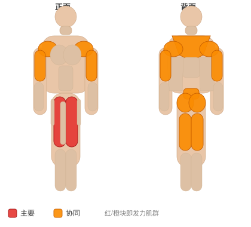

# 抓举

**Snatch**

> 部位：全身　|　器械：杠铃　|　难度：⭐⭐ 进阶　|　类型：奥林匹克举重 · 复合动作 · 拉

## 目标肌群

- **主要**：股四头肌（大腿前侧）
- **协同**：肱二头肌、臀大肌、腘绳肌（大腿后侧）、下背（竖脊肌）、三角肌、斜方肌、肱三头肌

## 肌肉激活示意

🔴 主要肌群　🟠 协同肌群（红/橙块即发力部位，鼠标悬停看名称）

## 动作示意图

| 起始位 | 结束位 |
|:---:|:---:|
|  |  |

## 动作要点

1. 这是技术性极高的举重动作，强烈建议先在教练指导下用空杆学习动作模式。
2. 起始姿势：杠贴小腿，挺胸收肩胛，背部中立，核心绷紧。
3. 第一发力：用腿把杠「推离」地面，保持背角不变，杠贴腿上行。
4. 第二发力：过膝后爆发式伸髋伸膝、耸肩提肘，把杠加速向上。
5. 接杠：迅速下潜到接杠位置稳住，站起完成，然后有控制地放下杠铃。

## 常见错误

- ❌ 用手臂拉杠 → 手臂只负责传导，发力靠髋腿
- ❌ 杠远离身体走弧线 → 力臂变大，几乎必失败
- ❌ 未掌握技术就上大重量 → 受伤风险极高
- ✅ 空杆练技术、杠贴身走、髋腿主导发力

## 训练建议

5–6 组 × 2–3 次，组间休息 2–3 分钟；技术优先，宁轻勿重。

<b>英文原始步骤 / Original Instructions</b>（点击展开）

1. Place your feet at a shoulder width stance with the barbell resting right above the connection between the toes and the rest of the foot.
2. With a palms facing down grip, bend at the knees and keeping the back flat grab the bar using a wider than shoulder width grip. Bring the hips down and make sure that your body drops as if you were going to sit on a chair. This will be your starting position.
3. Start pushing the floor as if it were a moving platform with your feet and simultaneously start lifting the barbell keeping it close to your legs.
4. As the bar reaches the middle of your thighs, push the floor with your legs and lift your body to a complete extension in an explosive motion.
5. Lift your shoulders back in a shrugging movement as you bring the bar up while lifting your elbows out to the side and keeping them above the bar for as long as possible.
6. Now in a very quick but powerful motion, you have to get your body under the barbell when it has reached a high enough point where it can be controlled and drop while locking your arms and holding the barbell overhead as you assume a squat position.
7. Finalize the movement by rising up out of the squat position to finish the lift. At the end of the lift both feet should be on line and the arms fully extended holding the barbell overhead.

---

[← 返回全身部位索引](README.md)　|　[返回首页](../../README.md)

数据与图片来源：[yuhonas/free-exercise-db](https://github.com/yuhonas/free-exercise-db)（The Unlicense，公有领域）　·　中文名称、动作要点与内容组织：Yue（gengyueworks）