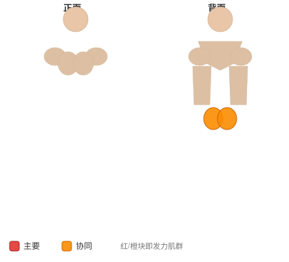
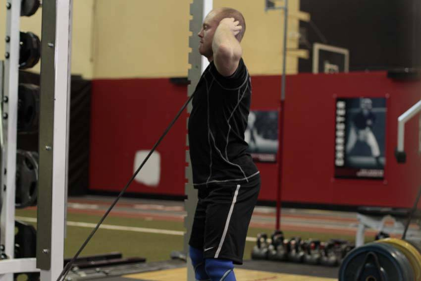

# 弹力带早安式体前屈（拉）

**Band Good Morning (Pull Through)**

> 部位：腿臀　|　器械：弹力带　|　难度：⭐ 新手　|　类型：力量举 · 复合动作 · 拉

## 目标肌群

- **主要**：腘绳肌（大腿后侧）
- **协同**：臀大肌、下背（竖脊肌）

## 肌肉激活示意

🔴 主要肌群　🟠 协同肌群（红/橙块即发力部位，鼠标悬停看名称）

## 动作示意图

| 起始位 | 结束位 |
|:---:|:---:|
|  |  |

## 动作要点

1. 双脚约与髋同宽，弹力带贴近小腿，杠位于脚掌中部正上方。
2. 屈髋屈膝下去握杠，挺胸收肩胛，背部保持中立——这一步最关键。
3. 吸气憋住核心，先用腿把地面「蹬开」，杠贴着腿向上走。
4. 髋膝同步伸展，过膝后髋部前顶站直，顶端夹紧臀部但不要后仰。
5. 下放时先屈髋把杠沿腿送下去，过膝再屈膝，保持背部中立。

## 常见错误

- ❌ 弓背起杠 → 腰椎间盘压力剧增，最危险的错误
- ❌ 杠离小腿太远 → 力臂变长，腰部代偿
- ❌ 顶端过度后仰 → 腰椎超伸，没有额外收益
- ✅ 杠贴腿走、背部中立、髋膝同步、顶端只需站直

## 训练建议

3–5 组 × 1–5 次，组间休息 3–5 分钟；大重量务必有人保护。

<b>英文原始步骤 / Original Instructions</b>（点击展开）

1. Loop the band around a post. Standing a little ways away, loop the opposite end around the neck. Your hands can help hold the band in position.
2. Begin by bending at the hips, getting your butt back as far as possible. Keep your back flat and bend forward to about 90 degrees. Your knees should be only slightly bent.
3. Return to the starting position be driving through with the hips to come back to a standing position.

---

[← 返回腿臀部位索引](README.md)　|　[返回首页](../../README.md)

数据与图片来源：[yuhonas/free-exercise-db](https://github.com/yuhonas/free-exercise-db)（The Unlicense，公有领域）　·　中文名称、动作要点与内容组织：Yue（gengyueworks）