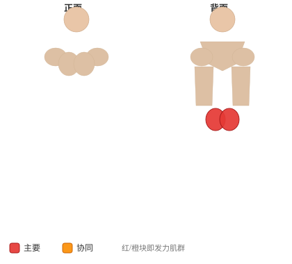

# 臀桥

**Butt Lift (Bridge)**

> 部位：腿臀　|　器械：自重　|　难度：⭐ 新手　|　类型：力量训练 · 孤立动作 · 推

## 目标肌群

- **主要**：臀大肌
- **协同**：腘绳肌（大腿后侧）

## 肌肉激活示意

🔴 主要肌群　🟠 协同肌群（红/橙块即发力部位，鼠标悬停看名称）

## 动作示意图

| 起始位 | 结束位 |
|:---:|:---:|
|  |  |

## 动作要点

1. 肩胛骨下缘卡在凳面边缘，双脚踩实地面，小腿在顶端应接近垂直。
2. 自身体重置于髋部（垫好软垫），下巴微收，视线看向前下方。
3. 呼气，用臀部发力顶髋向上，直到肩、髋、膝成一条直线。
4. 顶峰主动夹紧臀部 1–2 秒，这一秒是这个动作的全部价值。
5. 吸气缓慢下放，臀部接近地面但不完全放松。

## 常见错误

- ❌ 用腰顶而不是髋顶 → 练完腰酸而不是臀酸
- ❌ 顶端过度伸展腰椎 → 腰椎超伸
- ❌ 下巴抬高、视线朝天 → 颈椎紧张、骨盆前倾
- ✅ 收下巴、髋部发力、顶峰夹紧

## 训练建议

3–4 组 × 10–15 次，组间休息 45–75 秒；小重量找目标肌群的收缩感。

<b>英文原始步骤 / Original Instructions</b>（点击展开）

1. Lie flat on the floor on your back with the hands by your side and your knees bent. Your feet should be placed around shoulder width. This will be your starting position.
2. Pushing mainly with your heels, lift your hips off the floor while keeping your back straight. Breathe out as you perform this part of the motion and hold at the top for a second.
3. Slowly go back to the starting position as you breathe in.

---

[← 返回腿臀部位索引](README.md)　|　[返回首页](../../README.md)

数据与图片来源：[yuhonas/free-exercise-db](https://github.com/yuhonas/free-exercise-db)（The Unlicense，公有领域）　·　中文名称、动作要点与内容组织：Yue（gengyueworks）