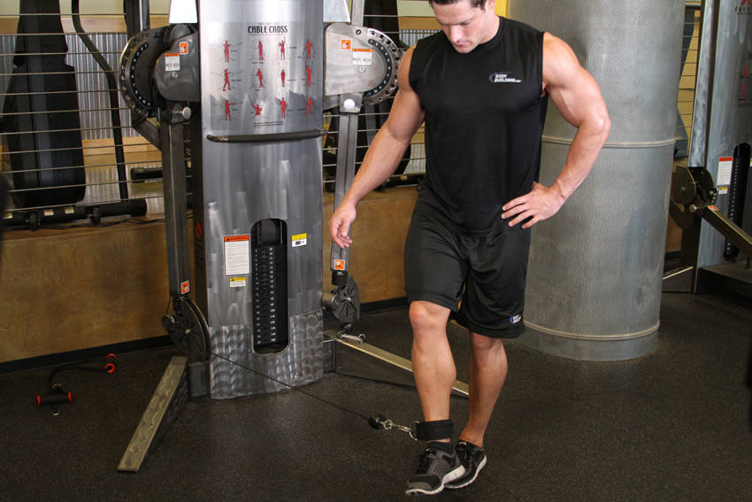

# 绳索髋内收

**Cable Hip Adduction**

> 部位：腿臀　|　器械：绳索　|　难度：⭐ 新手　|　类型：力量训练 · 孤立动作 · 拉

## 目标肌群

- **主要**：股四头肌（大腿前侧）
- **协同**：—

## 动作示意图

| 起始位 | 结束位 |
|:---:|:---:|
|  |  |

## 动作要点

1. 调整好起始姿势，用绳索建立稳定的支撑与握持。
2. 核心收紧、脊柱保持中立，这是所有动作的共同前提。
3. 呼气发力，用股四头肌主导完成动作，避免其他部位代偿借力。
4. 在肌肉完全收缩的位置停顿一秒，主动感受股四头肌发力。
5. 吸气用 2–3 秒缓慢还原到起始位，全程保持张力不松掉。

## 常见错误

- ❌ 靠身体摆动借力 → 通常意味着重量选大了
- ❌ 只做半程 → 肌肉没有被充分拉长和收缩
- ❌ 屏气硬撑 → 血压骤升，发力时呼气才对
- ✅ 控制节奏、完整幅度、目标肌群主导

## 训练建议

3–4 组 × 10–15 次，组间休息 45–75 秒；小重量找目标肌群的收缩感。

<b>英文原始步骤 / Original Instructions</b>（点击展开）

1. Stand in front of a low pulley facing forward with one leg next to the pulley and the other one away.
2. Attach the ankle cuff to the cable and also to the ankle of the leg that is next to the pulley.
3. Now step out and away from the stack with a wide stance and grasp the bar of the pulley system.
4. Stand on the foot that does not have the ankle cuff (the far foot) and allow the leg with the cuff to be pulled towards the low pulley. This will be your starting position.
5. Now perform the movement by moving the leg with the ankle cuff in front of the far leg by using the inner thighs to abduct the hip. Breathe out during this portion of the movement.
6. Slowly return to the starting position as you breathe in.
7. Repeat for the recommended amount of repetitions and then repeat the same movement with the opposite leg.

---

[← 返回腿臀部位索引](README.md)　|　[返回首页](../../README.md)

数据与图片来源：[yuhonas/free-exercise-db](https://github.com/yuhonas/free-exercise-db)（The Unlicense，公有领域）　·　中文名称、动作要点与内容组织：Yue（gengyueworks）
