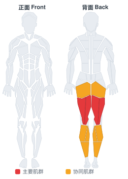
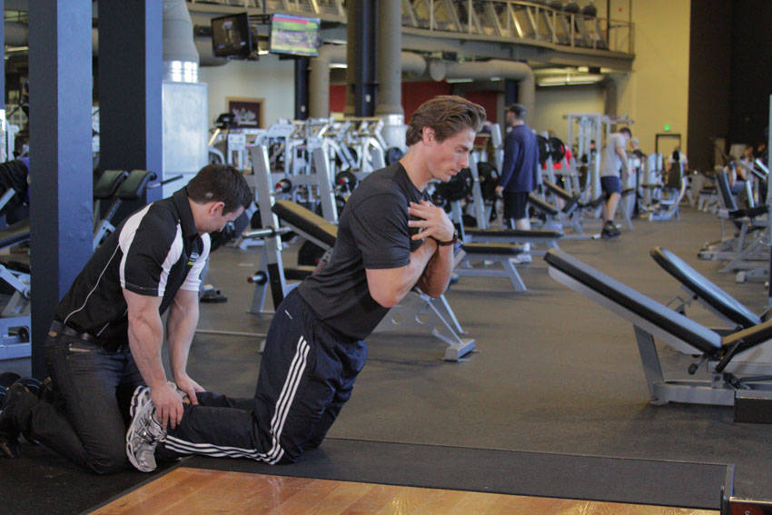

# 地面臀腘绳肌上举

**Floor Glute-Ham Raise**

> 部位：腿臀　|　器械：其他　|　难度：⭐⭐ 进阶　|　类型：力量训练 · 孤立动作 · 拉

## 目标肌群

- **主要**：腘绳肌（大腿后侧）
- **协同**：小腿（腓肠肌/比目鱼肌）、臀大肌

## 肌肉激活示意

🔴 主要肌群　🟠 协同肌群（红/橙块即发力部位，鼠标悬停看名称）

## 动作示意图

| 起始位 | 结束位 |
|:---:|:---:|
|  |  |

## 动作要点

1. 调整器械，让膝关节刚好在垫子边缘、转轴对齐。
2. 脚踝后侧卡在滚轴下方，双手握住把手稳定身体。
3. 呼气，脚跟朝臀部方向勾起，用腘绳肌发力而不是甩小腿。
4. 顶峰收缩一秒，感受大腿后侧完全缩短。
5. 吸气缓慢放回，直到腿接近伸直但保留张力。

## 常见错误

- ❌ 臀部抬离垫子借力 → 腰部代偿
- ❌ 靠惯性甩动 → 腘绳肌几乎没受力
- ❌ 幅度过小 → 顶峰没收紧、底部没拉长
- ✅ 轴心对齐、臀部贴垫、慢起慢落

## 训练建议

3–4 组 × 10–15 次，组间休息 45–75 秒；小重量找目标肌群的收缩感。

<b>英文原始步骤 / Original Instructions</b>（点击展开）

1. You can use a partner for this exercise or brace your feet under something stable.
2. Begin on your knees with your upper legs and torso upright. If using a partner, they will firmly hold your feet to keep you in position. This will be your starting position.
3. Lower yourself by extending at the knee, taking care to NOT flex the hips as you go forward.
4. Place your hands in front of you as you reach the floor. This movement is very difficult and you may be unable to do it unaided. Use your arms to lightly push off the floor to aid your return to the starting position.

---

[← 返回腿臀部位索引](README.md)　|　[返回首页](../../README.md)

数据与图片来源：[yuhonas/free-exercise-db](https://github.com/yuhonas/free-exercise-db)（The Unlicense，公有领域）　·　中文名称、动作要点与内容组织：Yue（gengyueworks）