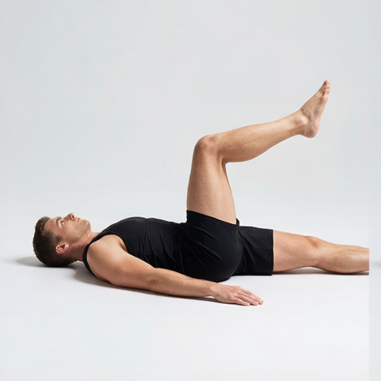
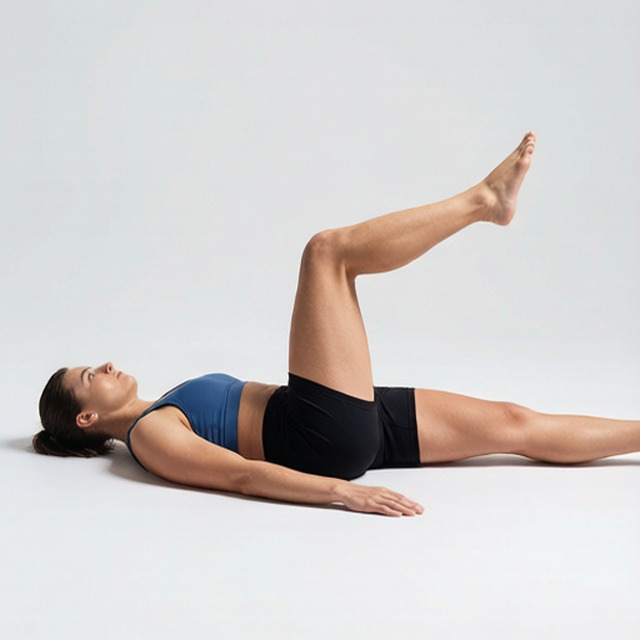

# 交替踢腿

**Flutter Kicks**

> 部位：腿臀　|　器械：自重　|　难度：⭐ 新手　|　类型：力量训练 · 复合动作 · 拉

## 目标肌群

- **主要**：臀大肌
- **协同**：腘绳肌（大腿后侧）

## 肌肉激活示意

🔴 主要肌群　🟠 协同肌群（红/橙块即发力部位，鼠标悬停看名称）

## 动作示意图

| 起始位 | 结束位 |
|:---:|:---:|
|  |  |

## 动作要点

1. 固定上半身（悬垂时先沉肩，仰卧时下背贴地）。
2. 起始时核心先收紧，避免用髋屈肌单独发力。
3. 呼气，用下腹发力把腿或膝盖抬起，同时骨盆微微后卷。
4. 抬到腹部完全收缩的位置，顶峰停顿一秒。
5. 吸气缓慢下放，全程不让身体前后摆荡。

## 常见错误

- ❌ 身体大幅摆荡借力 → 腹肌几乎不参与
- ❌ 只抬腿不卷骨盆 → 变成练髋屈肌
- ❌ 下放时腰部离地拱起 → 腰椎受压
- ✅ 先卷骨盆、控制节奏、下背始终贴住

## 训练建议

3–5 组 × 6–12 次，组间休息 90–150 秒；先把动作做标准再加重量。

<b>英文原始步骤 / Original Instructions</b>（点击展开）

1. On a flat bench lie facedown with the hips on the edge of the bench, the legs straight with toes high off the floor and with the arms on top of the bench holding on to the front edge.
2. Squeeze your glutes and hamstrings and straighten the legs until they are level with the hips. This will be your starting position.
3. Start the movement by lifting the left leg higher than the right leg.
4. Then lower the left leg as you lift the right leg.
5. Continue alternating in this manner (as though you are doing a flutter kick in water) until you have done the recommended amount of repetitions for each leg. Make sure that you keep a controlled movement at all times. Tip: You will breathe normally as you perform this movement.

---

[← 返回腿臀部位索引](README.md)　|　[返回首页](../../README.md)

数据与图片来源：[yuhonas/free-exercise-db](https://github.com/yuhonas/free-exercise-db)（The Unlicense，公有领域）　·　中文名称、动作要点与内容组织：Yue（gengyueworks）