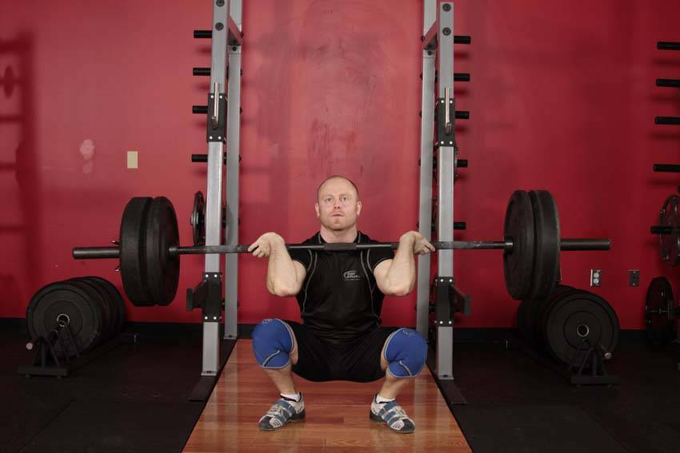

# 前侧深蹲（翻站握法）

**Front Squat (Clean Grip)**

> 部位：腿臀　|　器械：杠铃　|　难度：⭐⭐ 进阶　|　类型：力量训练 · 复合动作 · 推

## 目标肌群

- **主要**：股四头肌（大腿前侧）
- **协同**：腹肌、臀大肌、腘绳肌（大腿后侧）

## 动作示意图

| 起始位 | 结束位 |
|:---:|:---:|
|  |  |

## 动作要点

1. 这是技术性极高的举重动作，强烈建议先在教练指导下用空杆学习动作模式。
2. 起始姿势：杠贴小腿，挺胸收肩胛，背部中立，核心绷紧。
3. 第一发力：用腿把杠「推离」地面，保持背角不变，杠贴腿上行。
4. 第二发力：过膝后爆发式伸髋伸膝、耸肩提肘，把杠加速向上。
5. 接杠：迅速下潜到接杠位置稳住，站起完成，然后有控制地放下杠铃。

## 常见错误

- ❌ 用手臂拉杠 → 手臂只负责传导，发力靠髋腿
- ❌ 杠远离身体走弧线 → 力臂变大，几乎必失败
- ❌ 未掌握技术就上大重量 → 受伤风险极高
- ✅ 空杆练技术、杠贴身走、髋腿主导发力

## 训练建议

3–5 组 × 6–12 次，组间休息 90–150 秒；先把动作做标准再加重量。

<b>英文原始步骤 / Original Instructions</b>（点击展开）

1. To begin, first set the bar in a rack slightly below shoulder level. Rest the bar on top of the deltoids, pushing into the clavicles, and lightly touching the throat. Your hands should be in a clean grip, touching the bar only with your fingers to help keep it in position.
2. Lift the bar off the rack by first pushing with your legs and at the same time straightening your torso. Step away from the rack and position your legs using a shoulder width medium stance with the toes slightly pointed out. Keep your head and elbows up at all times. This will be your starting position.
3. Bend at the knees, sitting down between your legs. Continue down until your hamstrings are on your calves. Keep your knees aligned with your feet by consciously using your abductors to push your knees out as you squat.
4. Begin to raise the bar as you exhale by pushing the floor mainly with the heel or middle of your foot as you straighten the legs again and return to the starting position.

---

[← 返回腿臀部位索引](README.md)　|　[返回首页](../../README.md)

数据与图片来源：[yuhonas/free-exercise-db](https://github.com/yuhonas/free-exercise-db)（The Unlicense，公有领域）　·　中文名称、动作要点与内容组织：Yue（gengyueworks）
