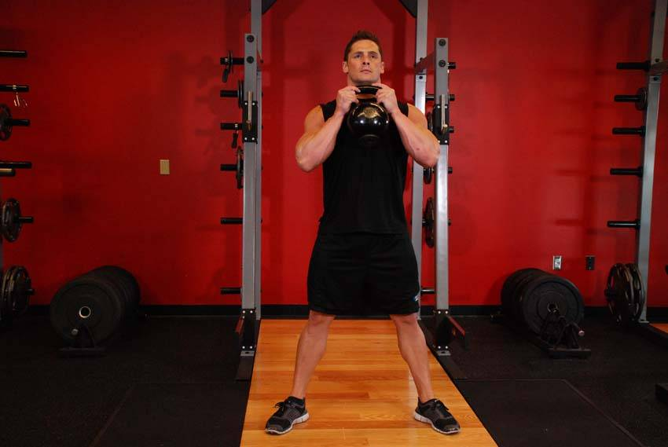

# 高脚杯深蹲

**Goblet Squat**

> 部位：腿臀　|　器械：壶铃　|　难度：⭐ 新手　|　类型：力量训练 · 复合动作 · 推

## 目标肌群

- **主要**：股四头肌（大腿前侧）
- **协同**：小腿（腓肠肌/比目鱼肌）、臀大肌、腘绳肌（大腿后侧）、三角肌

## 动作示意图

| 起始位 | 结束位 |
|:---:|:---:|
|  |  |

## 动作要点

1. 壶铃稳定在背部斜方肌上（或按动作要求持握），双脚与肩同宽、脚尖略外展。
2. 吸气、核心收紧，想象「用腹部顶住一条腰带」再下蹲。
3. 髋部先向后向下坐，膝盖始终朝脚尖方向打开，不要内扣。
4. 蹲到大腿与地面平行或更低（以能保持腰背中立为准）。
5. 呼气蹬地起身，全脚掌发力，顶端髋部前顶，膝盖不锁死。

## 常见错误

- ❌ 膝盖内扣 → 半月板和韧带受损的首要原因
- ❌ 脚跟离地 → 重心前移，压力全给膝盖前侧
- ❌ 底部弓腰（俗称「屁股眨眼」） → 腰椎受剪切力
- ✅ 膝盖跟脚尖同向、全脚掌踩实、核心全程绷住

## 训练建议

3–5 组 × 6–12 次，组间休息 90–150 秒；先把动作做标准再加重量。

<b>英文原始步骤 / Original Instructions</b>（点击展开）

1. Stand holding a light kettlebell by the horns close to your chest. This will be your starting position.
2. Squat down between your legs until your hamstrings are on your calves. Keep your chest and head up and your back straight.
3. At the bottom position, pause and use your elbows to push your knees out. Return to the starting position, and repeat for 10-20 repetitions.

---

[← 返回腿臀部位索引](README.md)　|　[返回首页](../../README.md)

数据与图片来源：[yuhonas/free-exercise-db](https://github.com/yuhonas/free-exercise-db)（The Unlicense，公有领域）　·　中文名称、动作要点与内容组织：Yue（gengyueworks）
