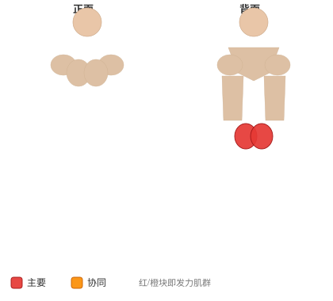
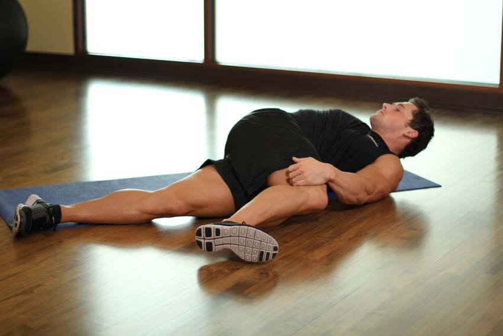

# 膝横跨身体拉伸

**Knee Across The Body**

> 部位：腿臀　|　器械：其他　|　难度：⭐ 新手　|　类型：拉伸放松 · — · 静态支撑

## 目标肌群

- **主要**：臀大肌
- **协同**：髋外展肌、下背（竖脊肌）

## 肌肉激活示意

🔴 主要肌群　🟠 协同肌群（红/橙块即发力部位，鼠标悬停看名称）

## 动作示意图

| 起始位 | 结束位 |
|:---:|:---:|
|  |  |

## 动作要点

1. 先做几分钟低强度活动让身体热起来，冷身状态别做大幅度静态拉伸。
2. 进入拉伸位置时缓慢推进，到臀大肌有明显牵拉感但不疼痛为止。
3. 保持 20–30 秒，全程自然呼吸，不要憋气。
4. 呼气时可以再稍微加深一点幅度，吸气时保持不动。
5. 两侧各做 2–3 组，训练后做静态拉伸效果最好。

## 常见错误

- ❌ 弹震式反复拉扯 → 触发牵张反射，反而更紧
- ❌ 拉到疼痛 → 可能造成肌肉或肌腱损伤
- ❌ 憋气硬撑 → 肌肉难以放松
- ✅ 热身后再拉、缓慢进入、呼吸放松

## 训练建议

每侧 2–3 组，每组静态保持 20–30 秒；训练后做效果最好。

<b>英文原始步骤 / Original Instructions</b>（点击展开）

1. Lie down on the floor with your right leg straight. Bend your left leg and lower it across your body, holding the knee down toward the floor with your right hand. (The knee doesn't need to touch the floor if you're tight.)
2. Place your left arm comfortably beside you and turn your head to the left. Imagine you have a weight tied to your tailbone. let your tailbone fall back toward the floor as your chest reaches in the opposite direction to stretch your lower back. Switch sides.

---

[← 返回腿臀部位索引](README.md)　|　[返回首页](../../README.md)

数据与图片来源：[yuhonas/free-exercise-db](https://github.com/yuhonas/free-exercise-db)（The Unlicense，公有领域）　·　中文名称、动作要点与内容组织：Yue（gengyueworks）