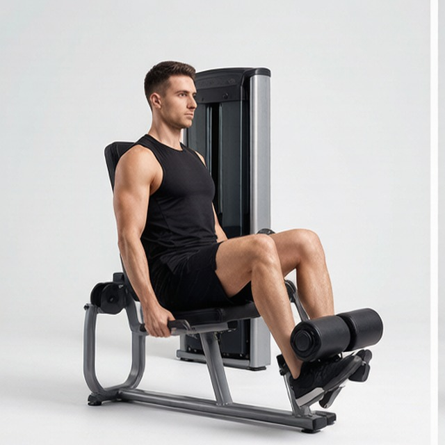
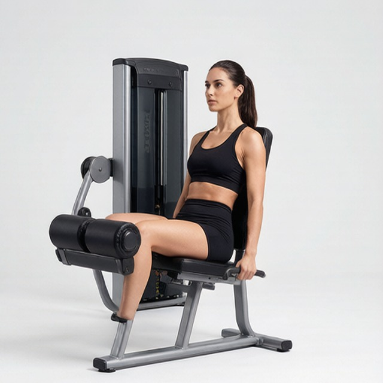

# 坐姿腿屈伸

**Leg Extensions**

> 部位：腿臀　|　器械：固定器械　|　难度：⭐ 新手　|　类型：力量训练 · 孤立动作 · 推

## 目标肌群

- **主要**：股四头肌（大腿前侧）
- **协同**：—

## 动作示意图

| 起始位 | 结束位 |
|:---:|:---:|
|  |  |

## 动作要点

1. 坐好，调整靠背让膝关节转轴与器械转轴对齐。
2. 滚轴卡在脚踝上方（小腿下段），不是压在脚背上。
3. 双手握住扶手固定身体，呼气伸直双腿。
4. 顶峰主动挤压股四头肌一秒，感受大腿前侧收紧。
5. 吸气用 2–3 秒缓慢屈腿放回，全程保持张力。

## 常见错误

- ❌ 靠身体前后晃动甩腿 → 借力且膝关节受冲击
- ❌ 滚轴压在脚背/脚踝上 → 踝关节疼痛
- ❌ 大重量猛踢到锁死 → 膝关节剪切力大
- ✅ 轴心对齐、匀速伸展、顶峰挤压

## 训练建议

3–4 组 × 10–15 次，组间休息 45–75 秒；小重量找目标肌群的收缩感。

<b>英文原始步骤 / Original Instructions</b>（点击展开）

1. For this exercise you will need to use a leg extension machine. First choose your weight and sit on the machine with your legs under the pad (feet pointed forward) and the hands holding the side bars. This will be your starting position. Tip: You will need to adjust the pad so that it falls on top of your lower leg (just above your feet). Also, make sure that your legs form a 90-degree angle between the lower and upper leg. If the angle is less than 90-degrees then that means the knee is over the toes which in turn creates undue stress at the knee joint. If the machine is designed that way, either look for another machine or just make sure that when you start executing the exercise you stop going down once you hit the 90-degree angle.
2. Using your quadriceps, extend your legs to the maximum as you exhale. Ensure that the rest of the body remains stationary on the seat. Pause a second on the contracted position.
3. Slowly lower the weight back to the original position as you inhale, ensuring that you do not go past the 90-degree angle limit.
4. Repeat for the recommended amount of times.

---

[← 返回腿臀部位索引](README.md)　|　[返回首页](../../README.md)

数据与图片来源：[yuhonas/free-exercise-db](https://github.com/yuhonas/free-exercise-db)（The Unlicense，公有领域）　·　中文名称、动作要点与内容组织：Yue（gengyueworks）
