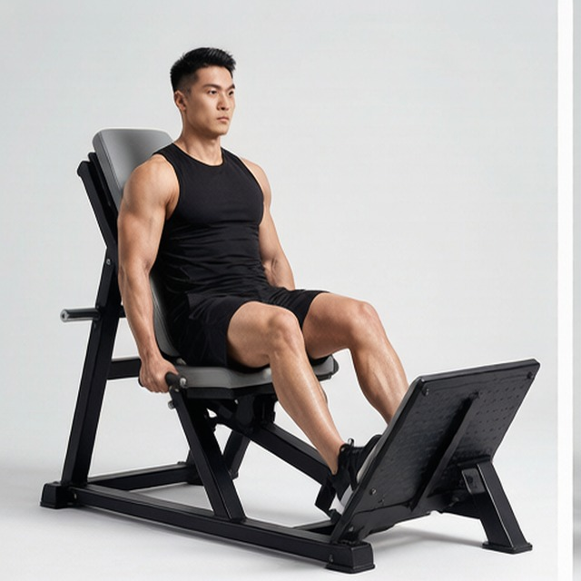
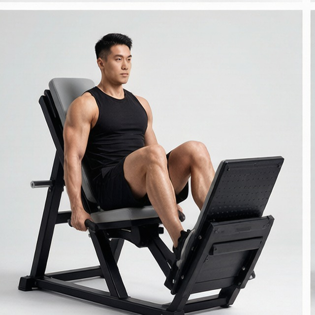
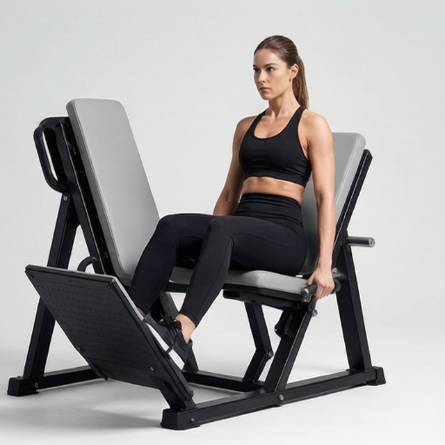
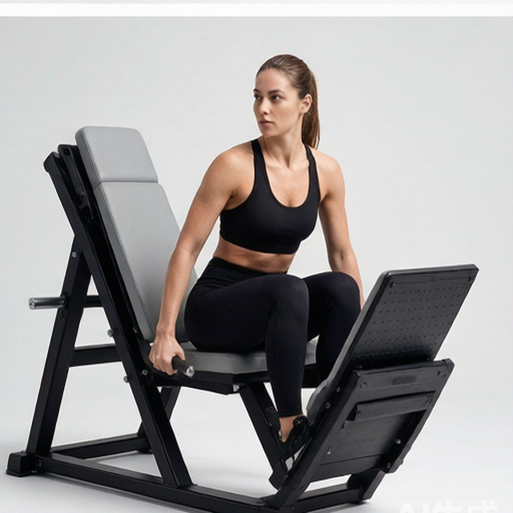

# 倒蹬机腿举

**Leg Press**

> 部位：腿臀　|　器械：固定器械　|　难度：⭐ 新手　|　类型：力量训练 · 复合动作 · 推

## 目标肌群

- **主要**：股四头肌（大腿前侧）
- **协同**：小腿（腓肠肌/比目鱼肌）、臀大肌、腘绳肌（大腿后侧）

## 肌肉激活示意

🔴 主要肌群　🟠 协同肌群（红/橙块即发力部位，鼠标悬停看名称）

## 动作示意图

|  | 起始位 | 结束位 |
|:---:|:---:|:---:|
| **男性** |  |  |
| **女性** |  |  |

## 动作要点

1. 坐进器械，背部和臀部完全贴紧靠垫，双脚与肩同宽踩在踏板上。
2. 脚位靠上更多练臀腿后侧，靠下更多练股四头肌。
3. 解锁安全锁，吸气屈膝下放，膝盖朝脚尖方向打开。
4. 下放到大腿接近胸口即可，一旦臀部要离开靠垫就是到底了。
5. 呼气蹬起，膝盖保持微屈不锁死，结束时先扣回安全锁再下器械。

## 常见错误

- ❌ 底部臀部离开靠垫（腰部悬空） → 腰椎受剪切力
- ❌ 顶端膝盖完全锁死 → 关节承重而非肌肉
- ❌ 双手抱膝帮忙推 → 说明重量选大了
- ✅ 腰臀贴垫、膝随脚尖、控制幅度

## 训练建议

3–5 组 × 6–12 次，组间休息 90–150 秒；先把动作做标准再加重量。

<b>英文原始步骤 / Original Instructions</b>（点击展开）

1. Using a leg press machine, sit down on the machine and place your legs on the platform directly in front of you at a medium (shoulder width) foot stance. (Note: For the purposes of this discussion we will use the medium stance described above which targets overall development; however you can choose any of the three stances described in the foot positioning section).
2. Lower the safety bars holding the weighted platform in place and press the platform all the way up until your legs are fully extended in front of you. Tip: Make sure that you do not lock your knees. Your torso and the legs should make a perfect 90-degree angle. This will be your starting position.
3. As you inhale, slowly lower the platform until your upper and lower legs make a 90-degree angle.
4. Pushing mainly with the heels of your feet and using the quadriceps go back to the starting position as you exhale.
5. Repeat for the recommended amount of repetitions and ensure to lock the safety pins properly once you are done. You do not want that platform falling on you fully loaded.

---

[← 返回腿臀部位索引](README.md)　|　[返回首页](../../README.md)

数据与图片来源：[yuhonas/free-exercise-db](https://github.com/yuhonas/free-exercise-db)（The Unlicense，公有领域）　·　中文名称、动作要点与内容组织：Yue（gengyueworks）