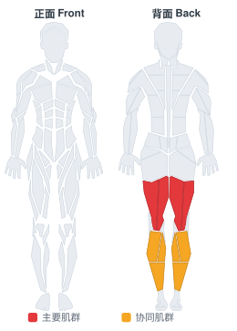

# 仰卧腘绳肌拉伸

**Lying Hamstring**

> 部位：腿臀　|　器械：其他　|　难度：⭐⭐⭐ 高手　|　类型：拉伸放松 · — · 静态支撑

## 目标肌群

- **主要**：腘绳肌（大腿后侧）
- **协同**：小腿（腓肠肌/比目鱼肌）

## 肌肉激活示意

🔴 主要肌群　🟠 协同肌群（红/橙块即发力部位，鼠标悬停看名称）

## 动作示意图

| 起始位 | 结束位 |
|:---:|:---:|
|  |  |

## 动作要点

1. 先做几分钟低强度活动让身体热起来，冷身状态别做大幅度静态拉伸。
2. 进入拉伸位置时缓慢推进，到腘绳肌有明显牵拉感但不疼痛为止。
3. 保持 20–30 秒，全程自然呼吸，不要憋气。
4. 呼气时可以再稍微加深一点幅度，吸气时保持不动。
5. 两侧各做 2–3 组，训练后做静态拉伸效果最好。

## 常见错误

- ❌ 弹震式反复拉扯 → 触发牵张反射，反而更紧
- ❌ 拉到疼痛 → 可能造成肌肉或肌腱损伤
- ❌ 憋气硬撑 → 肌肉难以放松
- ✅ 热身后再拉、缓慢进入、呼吸放松

## 训练建议

每侧 2–3 组，每组静态保持 20–30 秒；训练后做效果最好。

<b>英文原始步骤 / Original Instructions</b>（点击展开）

1. Lie on your back with your legs extended. Your partner should be kneeling beside you. Raise one leg up towards the ceiling and have your partner hold the ankle. Your partner can use their shoulder to brace your leg if necessary. This will be your starting position.
2. With your partner holding your leg in place, attempt to flex the knee, contracting the hamstrings for 10-20 seconds.
3. Then relax your leg, allowing your partner to gently push the leg towards your head. Be sure to inform your helper when the stretch is adequate to prevent injury or overstretching. Switch sides once complete.

---

[← 返回腿臀部位索引](README.md)　|　[返回首页](../../README.md)

数据与图片来源：[yuhonas/free-exercise-db](https://github.com/yuhonas/free-exercise-db)（The Unlicense，公有领域）　·　中文名称、动作要点与内容组织：Yue（gengyueworks）