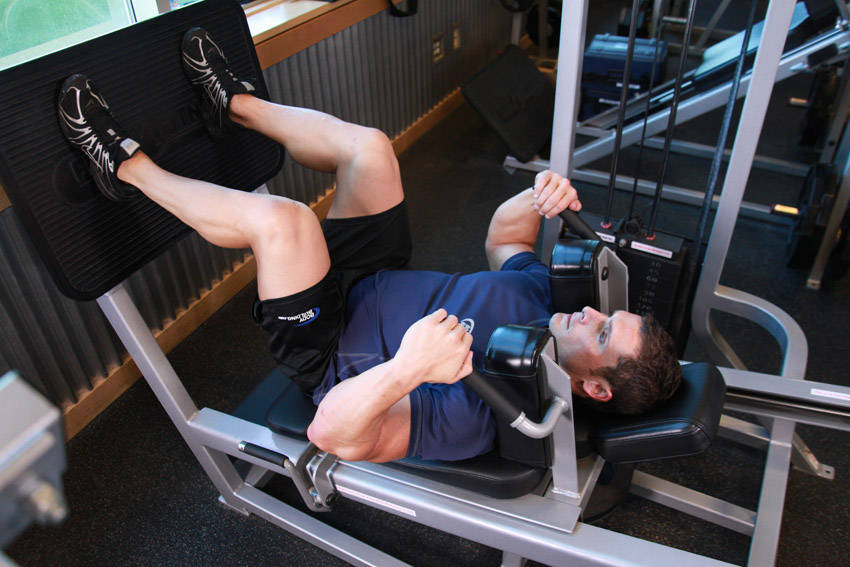
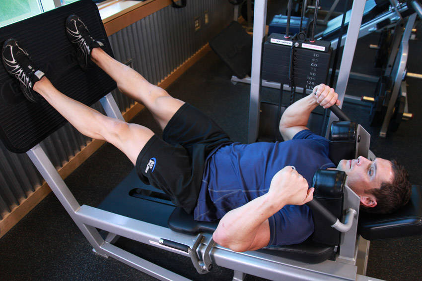

# 仰卧器械深蹲

**Lying Machine Squat**

> 部位：腿臀　|　器械：固定器械　|　难度：⭐⭐ 进阶　|　类型：力量训练 · 复合动作 · 推

## 目标肌群

- **主要**：股四头肌（大腿前侧）
- **协同**：小腿（腓肠肌/比目鱼肌）、臀大肌、腘绳肌（大腿后侧）

## 动作示意图

| 起始位 | 结束位 |
|:---:|:---:|
|  |  |

## 动作要点

1. 固定器械稳定在背部斜方肌上（或按动作要求持握），双脚与肩同宽、脚尖略外展。
2. 吸气、核心收紧，想象「用腹部顶住一条腰带」再下蹲。
3. 髋部先向后向下坐，膝盖始终朝脚尖方向打开，不要内扣。
4. 蹲到大腿与地面平行或更低（以能保持腰背中立为准）。
5. 呼气蹬地起身，全脚掌发力，顶端髋部前顶，膝盖不锁死。

## 常见错误

- ❌ 膝盖内扣 → 半月板和韧带受损的首要原因
- ❌ 脚跟离地 → 重心前移，压力全给膝盖前侧
- ❌ 底部弓腰（俗称「屁股眨眼」） → 腰椎受剪切力
- ✅ 膝盖跟脚尖同向、全脚掌踩实、核心全程绷住

## 训练建议

3–5 组 × 6–12 次，组间休息 90–150 秒；先把动作做标准再加重量。

<b>英文原始步骤 / Original Instructions</b>（点击展开）

1. Adjust the leg machine to a height that will allow you to get inside it with your knees bent and the thighs slightly below parallel.
2. Once you select the weight, position yourself inside the machine face up with the knees bent and thighs slightly below parallel to the platform. Make sure that the knees do not go past the toes. The angle created between the hamstrings and the calves should be one that is slightly less than 90 degrees (since your starting position requires you to start slightly below parallel). Your back and your head should be resting on the machine while your shoulders are pressed under the shoulder pads.
3. Place your hands by the handles and position your feet slightly pointing out at a shoulder width position. This will be your starting position.
4. While pressing with the balls of the feet as you breathe out, make your whole body erect as you squeeze the quads. Hold the contracted position for a second. Tip: Since you are starting below parallel, you can opt to use your hands to help you up by pressing on your thighs only on the first repetition.
5. Slowly squat down as you inhale but instead of going all the way down to the starting position, just stop once your thighs are parallel to the platform. The angle between your hamstrings and calves should be a 90-degree angle.
6. Repeat for the recommended amount of repetitions.

---

[← 返回腿臀部位索引](README.md)　|　[返回首页](../../README.md)

数据与图片来源：[yuhonas/free-exercise-db](https://github.com/yuhonas/free-exercise-db)（The Unlicense，公有领域）　·　中文名称、动作要点与内容组织：Yue（gengyueworks）
