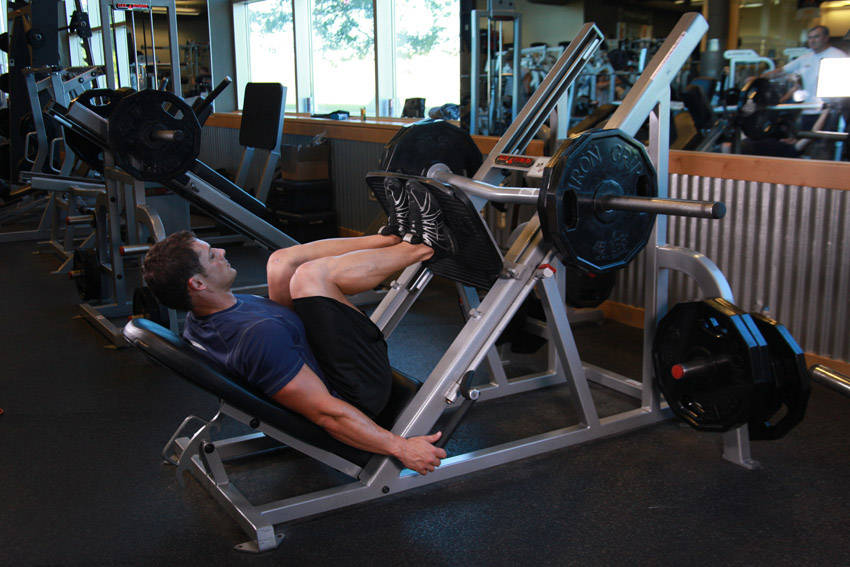

# 窄距站距腿举（倒蹬）

**Narrow Stance Leg Press**

> 部位：腿臀　|　器械：固定器械　|　难度：⭐⭐ 进阶　|　类型：力量训练 · 复合动作 · 推

## 目标肌群

- **主要**：股四头肌（大腿前侧）
- **协同**：小腿（腓肠肌/比目鱼肌）、臀大肌、腘绳肌（大腿后侧）

## 动作示意图

| 起始位 | 结束位 |
|:---:|:---:|
|  |  |

## 动作要点

1. 握住固定器械，脊柱保持中立，核心收紧，避免弓背。
2. 起始时让肩胛骨自然前伸，背阔肌被拉长。
3. 呼气，先收肩胛再用手肘向后拉，把固定器械带向腹部或下肋位置。
4. 顶峰挤压背部一秒，两侧肩胛向中间夹紧。
5. 吸气缓慢还原，全程躯干稳定不摇摆。

## 常见错误

- ❌ 弓背拉重量 → 腰椎受伤风险最高的错误
- ❌ 靠躯干起伏甩上来 → 背部没吃上力
- ❌ 手肘外展太多 → 变成练后束而非背阔肌
- ✅ 中立脊柱、先收肩胛、肘贴身后拉

## 训练建议

3–5 组 × 6–12 次，组间休息 90–150 秒；先把动作做标准再加重量。

<b>英文原始步骤 / Original Instructions</b>（点击展开）

1. Using a leg press machine, sit down on the machine and place your legs on the platform directly in front of you at a less-than-shoulder-width narrow stance with the toes slightly pointed out. Your feet should be around 3 inches or less apart. Tip: Keep your head up at all times and also maintain the back on the pad at all times.
2. Lower the safety bars holding the weighted platform in place and press the platform all the way up until your legs are fully extended in front of you. Tip: Make sure that you do not lock your knees. Your torso and the legs should make a perfect 90-degree angle. This will be your starting position.
3. As you inhale, slowly lower the platform until your upper and lower legs make a 90-degree angle.
4. Pushing mainly with the heels of your feet and using the quadriceps go back to the starting position as you exhale.
5. Repeat for the recommended amount of repetitions and ensure to lock the safety pins properly once you are done. You do not want that platform falling on you fully loaded.

---

[← 返回腿臀部位索引](README.md)　|　[返回首页](../../README.md)

数据与图片来源：[yuhonas/free-exercise-db](https://github.com/yuhonas/free-exercise-db)（The Unlicense，公有领域）　·　中文名称、动作要点与内容组织：Yue（gengyueworks）
