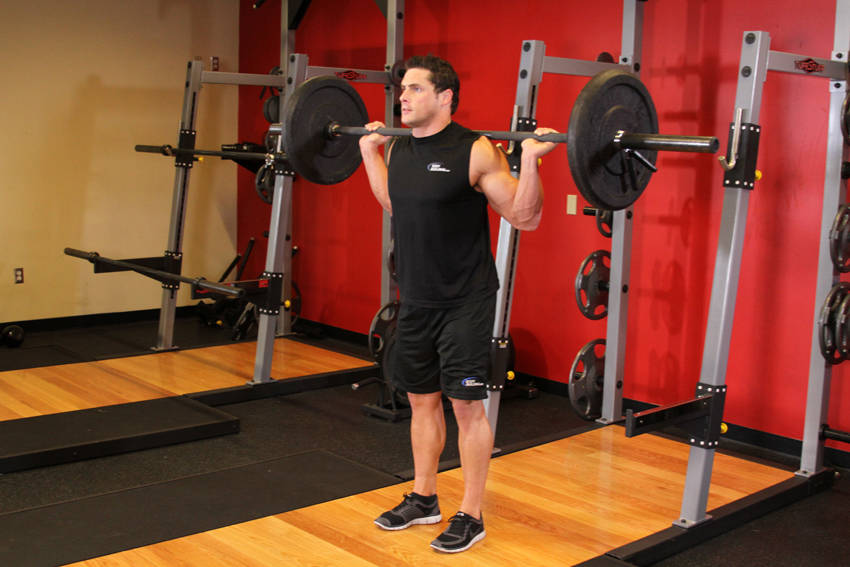

# 窄距站距深蹲

**Narrow Stance Squats**

> 部位：腿臀　|　器械：杠铃　|　难度：⭐⭐ 进阶　|　类型：力量训练 · 复合动作 · 推

## 目标肌群

- **主要**：股四头肌（大腿前侧）
- **协同**：小腿（腓肠肌/比目鱼肌）、臀大肌、腘绳肌（大腿后侧）、下背（竖脊肌）

## 动作示意图

| 起始位 | 结束位 |
|:---:|:---:|
|  |  |

## 动作要点

1. 握住杠铃，脊柱保持中立，核心收紧，避免弓背。
2. 起始时让肩胛骨自然前伸，背阔肌被拉长。
3. 呼气，先收肩胛再用手肘向后拉，把杠铃带向腹部或下肋位置。
4. 顶峰挤压背部一秒，两侧肩胛向中间夹紧。
5. 吸气缓慢还原，全程躯干稳定不摇摆。

## 常见错误

- ❌ 弓背拉重量 → 腰椎受伤风险最高的错误
- ❌ 靠躯干起伏甩上来 → 背部没吃上力
- ❌ 手肘外展太多 → 变成练后束而非背阔肌
- ✅ 中立脊柱、先收肩胛、肘贴身后拉

## 训练建议

3–5 组 × 6–12 次，组间休息 90–150 秒；先把动作做标准再加重量。

<b>英文原始步骤 / Original Instructions</b>（点击展开）

1. This exercise is best performed inside a squat rack for safety purposes. To begin, first set the bar on a rack that best matches your height. Once the correct height is chosen and the bar is loaded, step under the bar and place the back of your shoulders (slightly below the neck) across it.
2. Hold on to the bar using both arms at each side and lift it off the rack by first pushing with your legs and at the same time straightening your torso.
3. Step away from the rack and position your legs using a less-than-shoulder-width narrow stance with the toes slightly pointed out. Feet should be around 3-6 inches apart. Keep your head up at all times (looking down will get you off balance) and maintain a straight back. This will be your starting position. (Note: For the purposes of this discussion we will use the medium stance described above which targets overall development; however you can choose any of the three stances discussed in the foot stances section).
4. Begin to slowly lower the bar by bending the knees as you maintain a straight posture with the head up. Continue down until the angle between the upper leg and the calves becomes slightly less than 90-degrees (which is the point in which the upper legs are below parallel to the floor). Inhale as you perform this portion of the movement. Tip: If you performed the exercise correctly, the front of the knees should make an imaginary straight line with the toes that is perpendicular to the front. If your knees are past that imaginary line (if they are past your toes) then you are placing undue stress on the knee and the exercise has been performed incorrectly.
5. Begin to raise the bar as you exhale by pushing the floor with the heel of your foot mainly as you straighten the legs again and go back to the starting position.
6. Repeat for the recommended amount of repetitions.

---

[← 返回腿臀部位索引](README.md)　|　[返回首页](../../README.md)

数据与图片来源：[yuhonas/free-exercise-db](https://github.com/yuhonas/free-exercise-db)（The Unlicense，公有领域）　·　中文名称、动作要点与内容组织：Yue（gengyueworks）
