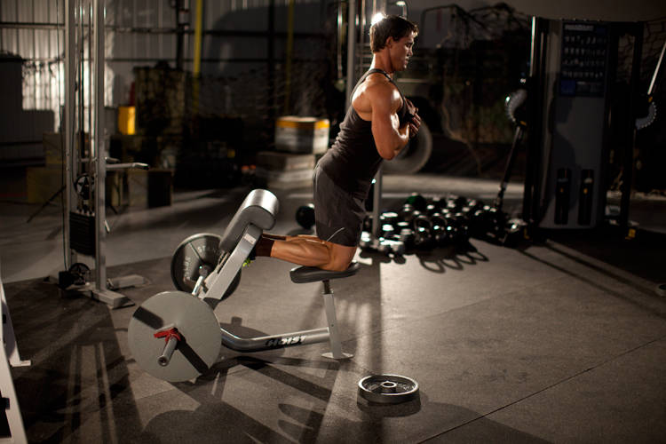
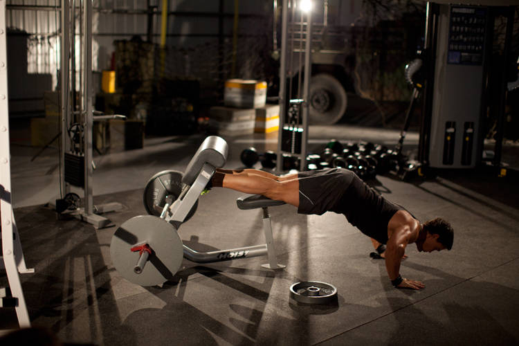

# 自然臀腘绳肌上举

**Natural Glute Ham Raise**

> 部位：腿臀　|　器械：自重　|　难度：⭐⭐ 进阶　|　类型：力量训练 · 复合动作 · 拉

## 目标肌群

- **主要**：腘绳肌（大腿后侧）
- **协同**：小腿（腓肠肌/比目鱼肌）、臀大肌、下背（竖脊肌）

## 动作示意图

| 起始位 | 结束位 |
|:---:|:---:|
|  |  |

## 动作要点

1. 持自身体重置于身体两侧，手肘保持微屈，肩膀主动下沉。
2. 呼气，用肩部带动手臂向侧上方抬起，想象「用手肘领着走」。
3. 抬到与肩同高即可，再高就变成斜方肌发力了。
4. 顶端停顿半秒，吸气用 2–3 秒缓慢下放，离心才是涨点。
5. 全程小重量、不借力，腘绳肌有灼烧感就对了。

## 常见错误

- ❌ 耸肩、用斜方肌把重量甩起来 → 练错肌肉
- ❌ 上半身前后晃动借力 → 重量选大了
- ❌ 抬过肩高 → 三角肌中束卸力
- ✅ 沉肩、肘领先、抬到肩高、慢放

## 训练建议

3–5 组 × 6–12 次，组间休息 90–150 秒；先把动作做标准再加重量。

<b>英文原始步骤 / Original Instructions</b>（点击展开）

1. Using the leg pad of a lat pulldown machine or a preacher bench, position yourself so that your ankles are under the pads, knees on the seat, and you are facing away from the machine. You should be upright and maintaining good posture.
2. This will be your starting position. Lower yourself under control until your knees are almost completely straight.
3. Remaining in control, raise yourself back up to the starting position.
4. If you are unable to complete a rep, use a band, a partner, or push off of a box to aid in completing a repetition.

---

[← 返回腿臀部位索引](README.md)　|　[返回首页](../../README.md)

数据与图片来源：[yuhonas/free-exercise-db](https://github.com/yuhonas/free-exercise-db)（The Unlicense，公有领域）　·　中文名称、动作要点与内容组织：Yue（gengyueworks）
