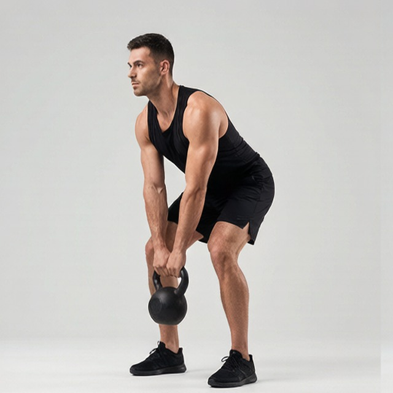
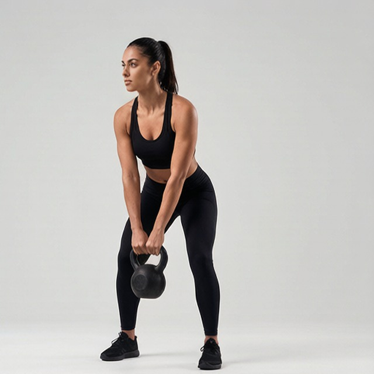

# 单臂壶铃摆荡

**One-Arm Kettlebell Swings**

> 部位：腿臀　|　器械：壶铃　|　难度：⭐⭐ 进阶　|　类型：力量训练 · 复合动作 · 拉

## 目标肌群

- **主要**：腘绳肌（大腿后侧）
- **协同**：小腿（腓肠肌/比目鱼肌）、臀大肌、下背（竖脊肌）、三角肌

## 动作示意图

| 起始位 | 结束位 |
|:---:|:---:|
|  |  |

## 动作要点

1. 双脚略宽于肩，壶铃放在身前一步远的位置，屈髋俯身握住它。
2. 背部中立、核心绷紧，先把壶铃向后「传」到两腿之间（像橄榄球开球）。
3. 爆发式伸髋站直，用臀部把壶铃「甩」出去——不是用手臂抬。
4. 到达最高点时臀部夹紧、核心收紧，壶铃处于失重状态。
5. 让壶铃自然回落，顺势屈髋进入下一次，全程保持节奏。

## 常见错误

- ❌ 用手臂往上抬 → 肩部先累，臀部没练到
- ❌ 变成深蹲式起落 → 这是髋铰链动作，不是深蹲
- ❌ 顶端腰椎后仰 → 腰部代偿
- ✅ 髋铰链发力、手臂只是绳子、顶端夹臀

## 训练建议

3–5 组 × 6–12 次，组间休息 90–150 秒；先把动作做标准再加重量。

---

[← 返回腿臀部位索引](README.md)　|　[返回首页](../../README.md)

数据与图片来源：[yuhonas/free-exercise-db](https://github.com/yuhonas/free-exercise-db)（The Unlicense，公有领域）　·　中文名称、动作要点与内容组织：Yue（gengyueworks）
