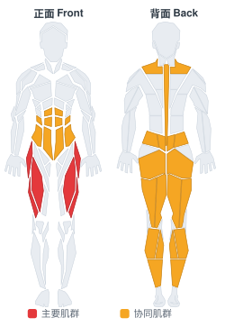
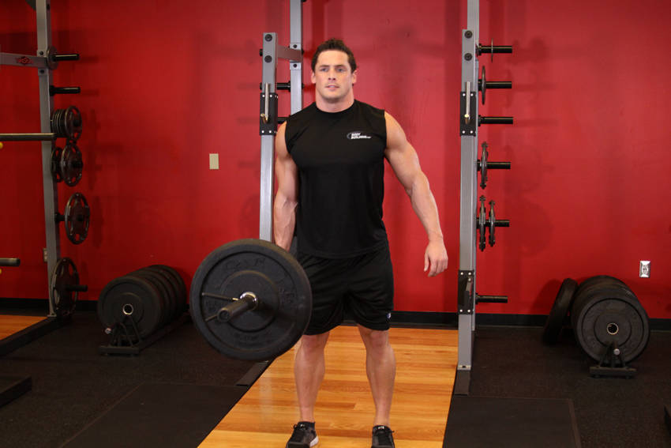

# 单臂侧向硬拉

**One-Arm Side Deadlift**

> 部位：腿臀　|　器械：杠铃　|　难度：⭐⭐⭐ 高手　|　类型：力量训练 · 复合动作 · 拉

## 目标肌群

- **主要**：股四头肌（大腿前侧）
- **协同**：腹肌、小腿（腓肠肌/比目鱼肌）、臀大肌、腘绳肌（大腿后侧）、下背（竖脊肌）、斜方肌

## 肌肉激活示意

🔴 主要肌群　🟠 协同肌群（红/橙块即发力部位，鼠标悬停看名称）

## 动作示意图

| 起始位 | 结束位 |
|:---:|:---:|
|  |  |

## 动作要点

1. 双脚约与髋同宽，杠铃贴近小腿，杠位于脚掌中部正上方。
2. 屈髋屈膝下去握杠，挺胸收肩胛，背部保持中立——这一步最关键。
3. 吸气憋住核心，先用腿把地面「蹬开」，杠贴着腿向上走。
4. 髋膝同步伸展，过膝后髋部前顶站直，顶端夹紧臀部但不要后仰。
5. 下放时先屈髋把杠沿腿送下去，过膝再屈膝，保持背部中立。

## 常见错误

- ❌ 弓背起杠 → 腰椎间盘压力剧增，最危险的错误
- ❌ 杠离小腿太远 → 力臂变长，腰部代偿
- ❌ 顶端过度后仰 → 腰椎超伸，没有额外收益
- ✅ 杠贴腿走、背部中立、髋膝同步、顶端只需站直

## 训练建议

3–5 组 × 6–12 次，组间休息 90–150 秒；先把动作做标准再加重量。

<b>英文原始步骤 / Original Instructions</b>（点击展开）

1. Stand to the side of a barbell next to its center. Bend your knees and lower your body until you are able to reach the barbell.
2. Grasp the bar as if you were grabbing a briefcase (palms facing you since the bar is sideways). You may need a wrist wrap if you are using a significant amount of weight. This is your starting position.
3. Use your legs to help lift the barbell up while exhaling. Your arms should extend fully as bring the barbell up until you are in a standing position.
4. Slowly bring the barbell back down while inhaling. Tip: Make sure to bend your knees while lowering the weight to avoid any injury from occurring.
5. Repeat for the recommended amount of repetitions.
6. Switch arms and repeat the movement.

---

[← 返回腿臀部位索引](README.md)　|　[返回首页](../../README.md)

数据与图片来源：[yuhonas/free-exercise-db](https://github.com/yuhonas/free-exercise-db)（The Unlicense，公有领域）　·　中文名称、动作要点与内容组织：Yue（gengyueworks）