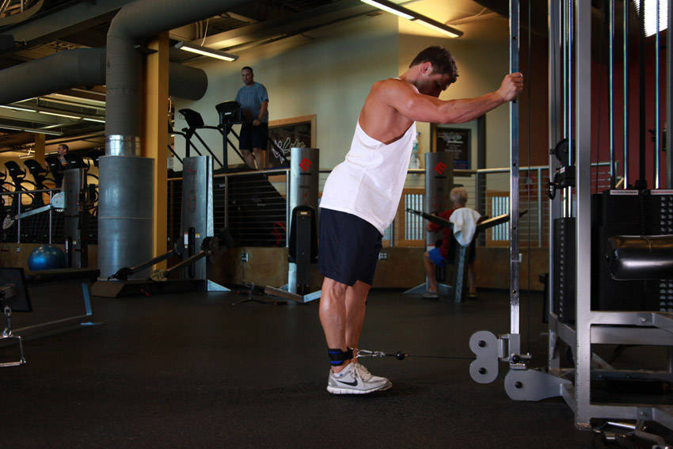

# 单腿绳索后踢臂屈伸

**One-Legged Cable Kickback**

> 部位：腿臀　|　器械：绳索　|　难度：⭐⭐ 进阶　|　类型：力量训练 · 孤立动作 · 推

## 目标肌群

- **主要**：臀大肌
- **协同**：腘绳肌（大腿后侧）

## 肌肉激活示意

🔴 主要肌群　🟠 协同肌群（红/橙块即发力部位，鼠标悬停看名称）

## 动作示意图

| 起始位 | 结束位 |
|:---:|:---:|
|  |  |

## 动作要点

1. 肩胛骨下缘卡在凳面边缘，双脚踩实地面，小腿在顶端应接近垂直。
2. 绳索置于髋部（垫好软垫），下巴微收，视线看向前下方。
3. 呼气，用臀部发力顶髋向上，直到肩、髋、膝成一条直线。
4. 顶峰主动夹紧臀部 1–2 秒，这一秒是这个动作的全部价值。
5. 吸气缓慢下放，臀部接近地面但不完全放松。

## 常见错误

- ❌ 用腰顶而不是髋顶 → 练完腰酸而不是臀酸
- ❌ 顶端过度伸展腰椎 → 腰椎超伸
- ❌ 下巴抬高、视线朝天 → 颈椎紧张、骨盆前倾
- ✅ 收下巴、髋部发力、顶峰夹紧

## 训练建议

3–4 组 × 10–15 次，组间休息 45–75 秒；小重量找目标肌群的收缩感。

<b>英文原始步骤 / Original Instructions</b>（点击展开）

1. Hook a leather ankle cuff to a low cable pulley and then attach the cuff to your ankle.
2. Face the weight stack from a distance of about two feet, grasping the steel frame for support.
3. While keeping your knees and hips bent slightly and your abs tight, contract your glutes to slowly "kick" the working leg back in a semicircular arc as high as it will comfortably go as you breathe out. Tip: At full extension, squeeze your glutes for a second in order to achieve a peak contraction.
4. Now slowly bring your working leg forward, resisting the pull of the cable until you reach the starting position.
5. Repeat for the recommended amount of repetitions.
6. Switch legs and repeat the movement for the other side.

---

[← 返回腿臀部位索引](README.md)　|　[返回首页](../../README.md)

数据与图片来源：[yuhonas/free-exercise-db](https://github.com/yuhonas/free-exercise-db)（The Unlicense，公有领域）　·　中文名称、动作要点与内容组织：Yue（gengyueworks）