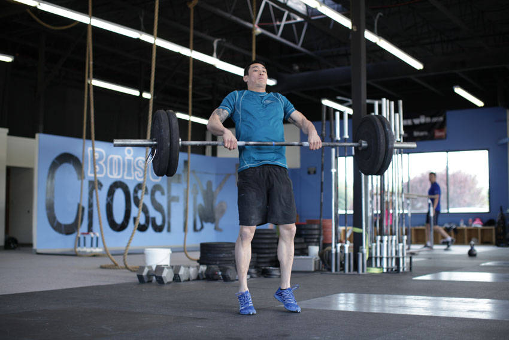

# 高翻

**Power Clean**

> 部位：腿臀　|　器械：杠铃　|　难度：⭐⭐ 进阶　|　类型：力量训练 · 复合动作 · 拉

## 目标肌群

- **主要**：腘绳肌（大腿后侧）
- **协同**：小腿（腓肠肌/比目鱼肌）、前臂、臀大肌、下背（竖脊肌）、中背（菱形肌/斜方肌中束）、股四头肌（大腿前侧）、三角肌、斜方肌、肱三头肌

## 动作示意图

| 起始位 | 结束位 |
|:---:|:---:|
|  |  |

## 动作要点

1. 这是技术性极高的举重动作，强烈建议先在教练指导下用空杆学习动作模式。
2. 起始姿势：杠贴小腿，挺胸收肩胛，背部中立，核心绷紧。
3. 第一发力：用腿把杠「推离」地面，保持背角不变，杠贴腿上行。
4. 第二发力：过膝后爆发式伸髋伸膝、耸肩提肘，把杠加速向上。
5. 接杠：迅速下潜到接杠位置稳住，站起完成，然后有控制地放下杠铃。

## 常见错误

- ❌ 用手臂拉杠 → 手臂只负责传导，发力靠髋腿
- ❌ 杠远离身体走弧线 → 力臂变大，几乎必失败
- ❌ 未掌握技术就上大重量 → 受伤风险极高
- ✅ 空杆练技术、杠贴身走、髋腿主导发力

## 训练建议

3–5 组 × 6–12 次，组间休息 90–150 秒；先把动作做标准再加重量。

<b>英文原始步骤 / Original Instructions</b>（点击展开）

1. Stand with your feet slightly wider than shoulder width apart and toes pointing out slightly.
2. Squat down and grasp bar with a closed, pronated grip. Your hands should be slightly wider than shoulder width apart outside knees with elbows fully extended.
3. Place the bar about 1 inch in front of your shins and over the balls of your feet.
4. Your back should be flat or slightly arched, your chest held up and out and your shoulder blades should be retracted.
5. Keep your head in a neutral position (in line with vertebral column and not tilted or rotated) with your eyes focused straight ahead. Inhale during this phase.
6. Lift the bar from the floor by forcefully extending the hips and the knees as you exhale. Tip: The upper torso should maintain the same angle. Do not bend at the waist yet and do not let the hips rise before the shoulders (this would have the effect of pushing the glutes in the air and stretching the hamstrings.
7. Keep elbows fully extended with the head in a neutral position and the shoulders over the bar.
8. As the bar raises keep it as close to the shins as possible.
9. As the bar passes the knees, thrust your hips forward and slightly bend the knees to avoid locking them. Tip: At this point your thighs should be against the bar.
10. Keep the back flat or slightly arched, elbows fully extended and your head neutral. Tip: You will hold your breath until the next phase.
11. Inhale and then forcefully and quickly extend your hips and knees and stand on your toes.
12. Keep the bar as close to your body as possible. Tip: Your back should be flat with the elbows pointed out to the sides and your head in a neutral position. Also, keep your shoulders over the bar and arms straight as long as possible.
13. When your lower body joints are fully extended, shrug the shoulders upward rapidly without letting the elbows flex yet. Exhale during this portion of the movement.
14. As the shoulders reach their highest elevation flex your elbows to begin pulling your body under the bar.
15. Continue to pull the arms as high and as long as possible. Tip: Due to the explosive nature of this phase, your torso will be erect or with an arched back, your head will be tilted back slightly and your feet may lose contact with the floor.
16. After the lower body has fully extended and the bar reaches near maximal height, pull your body under the bar and rotate the arms around and under the bar.
17. Simultaneously, flex the hips and knees into a quarter squat position.
18. Once the arms are under the bar, inhale and then lift your elbows to position the upper arms parallel to the floor. Rack the bar across the front of your collar bones and front shoulder muscles.
19. Catch the bar with an erect and tight torso, a neutral head position and flat feet. Exhale during this movement.
20. Stand up by extending the hips and knees to a fully erect position.
21. Lower the bar by gradually reducing the muscular tension of the arms to allow a controlled descent of the bar to the thighs. Inhale during this movement.
22. Simultaneously flex the hips and knees to cushion the impact of the bar on the thighs.
23. Squat down with the elbows fully extended until the bar touches the floor.
24. Start over at Phase 1 and repeat for the recommended amount of repetitions.

---

[← 返回腿臀部位索引](README.md)　|　[返回首页](../../README.md)

数据与图片来源：[yuhonas/free-exercise-db](https://github.com/yuhonas/free-exercise-db)（The Unlicense，公有领域）　·　中文名称、动作要点与内容组织：Yue（gengyueworks）
