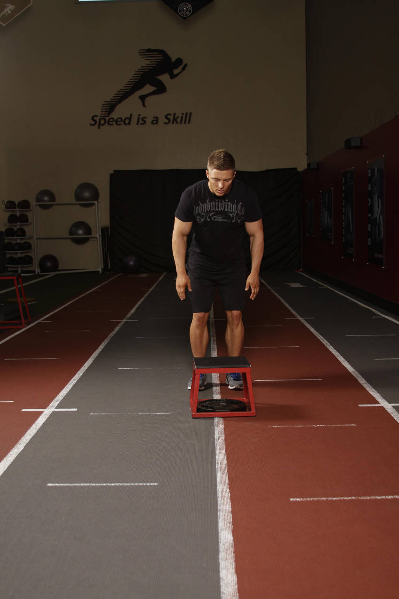

# 快速跃起

**Quick Leap**

> 部位：腿臀　|　器械：其他　|　难度：⭐ 新手　|　类型：爆发力/弹跳 · 复合动作 · 推

## 目标肌群

- **主要**：股四头肌（大腿前侧）
- **协同**：小腿（腓肠肌/比目鱼肌）、腘绳肌（大腿后侧）

## 动作示意图

| 起始位 | 结束位 |
|:---:|:---:|
|  |  |

## 动作要点

1. 充分热身后再做——爆发类动作对关节和肌腱要求高。
2. 起跳前屈髋屈膝下蹲蓄力，手臂自然后摆，核心收紧。
3. 快速有力地伸髋伸膝蹬地，手臂同时向上摆动带动身体。
4. 落地时前脚掌先着地，随即屈髋屈膝缓冲，像「轻轻落下」而不是砸下去。
5. 组间充分休息，质量优先于次数——动作变形就该停了。

## 常见错误

- ❌ 落地膝盖内扣 → 韧带损伤风险最高
- ❌ 落地直腿硬砸 → 冲击全给膝踝关节
- ❌ 疲劳状态下继续冲次数 → 爆发力训练最忌讳
- ✅ 充分热身、软着陆、宁少勿滥

## 训练建议

3–5 组 × 3–6 次，组间充分休息 2–3 分钟；追求每一次的质量，疲劳后立即停止。

<b>英文原始步骤 / Original Instructions</b>（点击展开）

1. You will need a box for this exerise.
2. Begin facing the box standing 1-2 feet from its edge.
3. By utilizing your hips, hop onto the box, landing on both legs. Ensure that you land with your legs bent and your feet flat.
4. Immediately upon landing, fully extend through the entire body and swing your arms overhead to explode off of the box. Use your legs to absorb the impact of landing.

---

[← 返回腿臀部位索引](README.md)　|　[返回首页](../../README.md)

数据与图片来源：[yuhonas/free-exercise-db](https://github.com/yuhonas/free-exercise-db)（The Unlicense，公有领域）　·　中文名称、动作要点与内容组织：Yue（gengyueworks）
