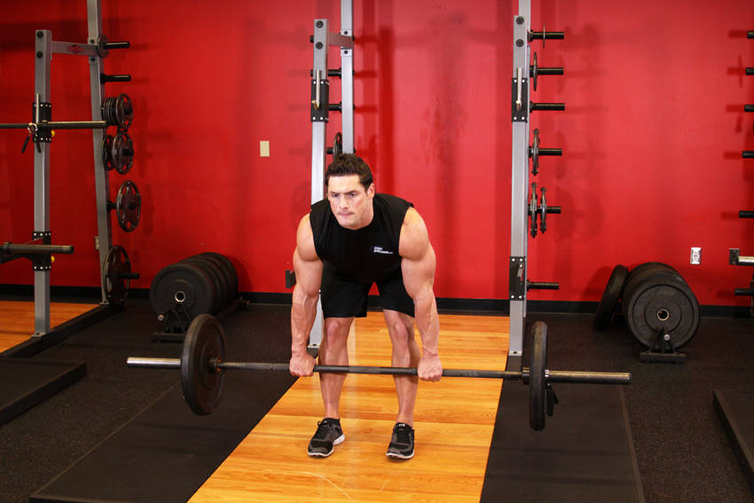
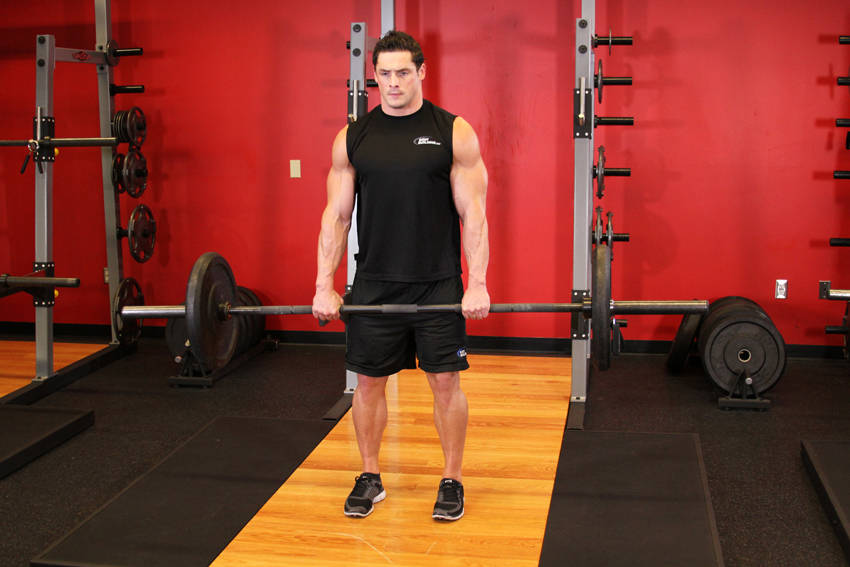

# 罗马尼亚硬拉

**Romanian Deadlift**

> 部位：腿臀　|　器械：杠铃　|　难度：⭐⭐ 进阶　|　类型：力量训练 · 复合动作 · 拉

## 目标肌群

- **主要**：腘绳肌（大腿后侧）
- **协同**：小腿（腓肠肌/比目鱼肌）、臀大肌、下背（竖脊肌）

## 动作示意图

| 起始位 | 结束位 |
|:---:|:---:|
|  |  |

## 动作要点

1. 双脚约与髋同宽，杠铃贴近小腿，杠位于脚掌中部正上方。
2. 屈髋屈膝下去握杠，挺胸收肩胛，背部保持中立——这一步最关键。
3. 吸气憋住核心，先用腿把地面「蹬开」，杠贴着腿向上走。
4. 髋膝同步伸展，过膝后髋部前顶站直，顶端夹紧臀部但不要后仰。
5. 下放时先屈髋把杠沿腿送下去，过膝再屈膝，保持背部中立。

## 常见错误

- ❌ 弓背起杠 → 腰椎间盘压力剧增，最危险的错误
- ❌ 杠离小腿太远 → 力臂变长，腰部代偿
- ❌ 顶端过度后仰 → 腰椎超伸，没有额外收益
- ✅ 杠贴腿走、背部中立、髋膝同步、顶端只需站直

## 训练建议

3–5 组 × 6–12 次，组间休息 90–150 秒；先把动作做标准再加重量。

<b>英文原始步骤 / Original Instructions</b>（点击展开）

1. Put a barbell in front of you on the ground and grab it using a pronated (palms facing down) grip that a little wider than shoulder width. Tip: Depending on the weight used, you may need wrist wraps to perform the exercise and also a raised platform in order to allow for better range of motion.
2. Bend the knees slightly and keep the shins vertical, hips back and back straight. This will be your starting position.
3. Keeping your back and arms completely straight at all times, use your hips to lift the bar as you exhale. Tip: The movement should not be fast but steady and under control.
4. Once you are standing completely straight up, lower the bar by pushing the hips back, only slightly bending the knees, unlike when squatting. Tip: Take a deep breath at the start of the movement and keep your chest up. Hold your breath as you lower and exhale as you complete the movement.
5. Repeat for the recommended amount of repetitions.

---

[← 返回腿臀部位索引](README.md)　|　[返回首页](../../README.md)

数据与图片来源：[yuhonas/free-exercise-db](https://github.com/yuhonas/free-exercise-db)（The Unlicense，公有领域）　·　中文名称、动作要点与内容组织：Yue（gengyueworks）
